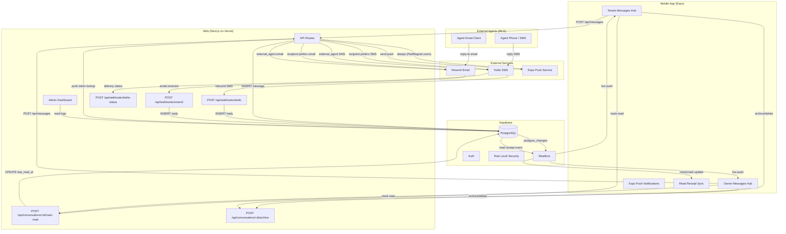

# PadMagnet Communications System — Implementation Plan v4

Updated 2026-03-14. Extends v3 (finalized 2026-03-13) with Messages Hub UX, read receipts, per-user archive/delete, swipe-to-manage, and conversation organization for both tenant and owner roles.

**v3 → v4 delta:** Sections 1–5 carry forward with additions marked `[v4 NEW]`. Sections 6–8 updated with complete code. Section 9 updated.

---

## 1. High-Level Architecture



**Flow summary (v3, unchanged):**
1. User sends message in-app → API inserts into `messages` → Supabase Realtime pushes to both parties instantly.
2. API checks recipient's `preferred_channel` → sends SMS (Twilio) or email (Resend). First attempt is synchronous; failures go to retry queue.
3. Recipient replies via SMS or email → webhook fires → API inserts reply → Realtime pushes to sender's chat UI.
4. Push notification fires for every message regardless of channel.
5. Both tenants and owners have fully symmetric access via RLS.
6. External MLS agent conversations: `conversation_type = 'external_agent'`, agent info stored on conversation row, replies routed back via webhooks.

**[v4 NEW] Additional flows:**
7. When a user opens a conversation, `POST /api/conversations/:id/mark-read` updates their `last_read_at` cursor. Realtime broadcasts this change so the counterparty sees blue read-receipt checkmarks on their sent messages.
8. Users can archive or soft-delete conversations via `POST /api/conversations/:id/archive`. Per-user — one party archiving does not affect the other. New incoming messages auto-unarchive.
9. Messages Hub shows 3 tabs (All / Unread / Archived) with swipe-to-archive and swipe-to-delete gestures.

**Implementation status:** ✅ Flows 1–6 COMPLETE (v3). ❌ Flows 7–9 NOT YET BUILT (v4).

---

## 2. Database Schema

### Existing (Migration 038 — ✅ COMPLETE)

```sql
-- conversations table extensions
ALTER TABLE conversations
  ADD COLUMN IF NOT EXISTS tenant_unread_count int DEFAULT 0,
  ADD COLUMN IF NOT EXISTS owner_unread_count int DEFAULT 0,
  ADD COLUMN IF NOT EXISTS conversation_type text DEFAULT 'internal_owner'
    CHECK (conversation_type IN ('internal_owner', 'external_agent')),
  ADD COLUMN IF NOT EXISTS external_agent_name text,
  ADD COLUMN IF NOT EXISTS external_agent_email text,
  ADD COLUMN IF NOT EXISTS external_agent_phone text;

-- messages: nullable sender_id for external agents
ALTER TABLE messages ALTER COLUMN sender_id DROP NOT NULL;
ALTER TABLE messages ADD COLUMN IF NOT EXISTS external_id text UNIQUE;

-- webhook_logs, message_templates, phone_mappings, message_delivery_queue
-- (all defined in migration 038 — see v3 plan for full DDL)

-- profile columns for notification preferences
ALTER TABLE profiles
  ADD COLUMN IF NOT EXISTS preferred_channel text DEFAULT 'in_app'
    CHECK (preferred_channel IN ('in_app', 'sms', 'email')),
  ADD COLUMN IF NOT EXISTS phone_verified boolean DEFAULT false,
  ADD COLUMN IF NOT EXISTS sms_consent boolean DEFAULT false,
  ADD COLUMN IF NOT EXISTS sms_consent_at timestamptz,
  ADD COLUMN IF NOT EXISTS sms_consent_ip text,
  ADD COLUMN IF NOT EXISTS expo_push_token text;

-- increment_unread RPC (atomic counter) — already live in Supabase
CREATE OR REPLACE FUNCTION increment_unread(
  p_conversation_id uuid,
  p_role text
) RETURNS void AS $$
BEGIN
  IF p_role = 'tenant' THEN
    UPDATE conversations
    SET tenant_unread_count = tenant_unread_count + 1,
        last_message_at = now(),
        updated_at = now()
    WHERE id = p_conversation_id;
  ELSIF p_role = 'owner' THEN
    UPDATE conversations
    SET owner_unread_count = owner_unread_count + 1,
        last_message_at = now(),
        updated_at = now()
    WHERE id = p_conversation_id;
  END IF;
END;
$$ LANGUAGE plpgsql SECURITY DEFINER;
```

### [v4 NEW] Migration 040: Read Receipts & Per-User Archive

```sql
-- ╔══════════════════════════════════════════════════════════════════╗
-- ║  Migration 040: Read receipts and per-user archive             ║
-- ║  Adds conversation-level read cursors and per-user archive     ║
-- ║  flags. Message-level read_at for precise receipt display.     ║
-- ╚══════════════════════════════════════════════════════════════════╝

-- A. Conversation-level read cursors (one per participant)
--    "Everything with created_at <= last_read_at is read"
ALTER TABLE conversations
  ADD COLUMN IF NOT EXISTS tenant_last_read_at timestamptz,
  ADD COLUMN IF NOT EXISTS owner_last_read_at timestamptz;

-- B. Per-user archive flags (independent — archiving doesn't affect the other party)
ALTER TABLE conversations
  ADD COLUMN IF NOT EXISTS archived_by_tenant boolean DEFAULT false,
  ADD COLUMN IF NOT EXISTS archived_by_owner boolean DEFAULT false;

-- C. Per-message read_at for display in thread view
--    Null = unread by recipient. Set when recipient opens the conversation.
ALTER TABLE messages
  ADD COLUMN IF NOT EXISTS read_at timestamptz;

-- D. Index for efficient unread queries
CREATE INDEX IF NOT EXISTS idx_conversations_tenant_unread
  ON conversations (tenant_user_id, archived_by_tenant)
  WHERE tenant_unread_count > 0;

CREATE INDEX IF NOT EXISTS idx_conversations_owner_unread
  ON conversations (owner_user_id, archived_by_owner)
  WHERE owner_unread_count > 0;

-- E. Index for archive tab queries
CREATE INDEX IF NOT EXISTS idx_conversations_tenant_archived
  ON conversations (tenant_user_id)
  WHERE archived_by_tenant = true;

CREATE INDEX IF NOT EXISTS idx_conversations_owner_archived
  ON conversations (owner_user_id)
  WHERE archived_by_owner = true;

-- F. RPC: mark conversation as read (updates cursor + zeroes unread count + stamps messages)
CREATE OR REPLACE FUNCTION mark_conversation_read(
  p_conversation_id uuid,
  p_user_id uuid,
  p_role text -- 'tenant' or 'owner'
) RETURNS void AS $$
BEGIN
  IF p_role = 'tenant' THEN
    UPDATE conversations
    SET tenant_last_read_at = now(),
        tenant_unread_count = 0,
        updated_at = now()
    WHERE id = p_conversation_id
      AND tenant_user_id = p_user_id;

    -- Stamp individual messages for read receipt display
    UPDATE messages
    SET read_at = now()
    WHERE conversation_id = p_conversation_id
      AND sender_id IS DISTINCT FROM p_user_id
      AND read_at IS NULL;
  ELSIF p_role = 'owner' THEN
    UPDATE conversations
    SET owner_last_read_at = now(),
        owner_unread_count = 0,
        updated_at = now()
    WHERE id = p_conversation_id
      AND owner_user_id = p_user_id;

    UPDATE messages
    SET read_at = now()
    WHERE conversation_id = p_conversation_id
      AND sender_id IS DISTINCT FROM p_user_id
      AND read_at IS NULL;
  END IF;
END;
$$ LANGUAGE plpgsql SECURITY DEFINER;

-- G. Update increment_unread to auto-unarchive on new message
CREATE OR REPLACE FUNCTION increment_unread(
  p_conversation_id uuid,
  p_role text
) RETURNS void AS $$
BEGIN
  IF p_role = 'tenant' THEN
    UPDATE conversations
    SET tenant_unread_count = tenant_unread_count + 1,
        last_message_at = now(),
        archived_by_tenant = false,  -- auto-unarchive
        updated_at = now()
    WHERE id = p_conversation_id;
  ELSIF p_role = 'owner' THEN
    UPDATE conversations
    SET owner_unread_count = owner_unread_count + 1,
        last_message_at = now(),
        archived_by_owner = false,  -- auto-unarchive
        updated_at = now()
    WHERE id = p_conversation_id;
  END IF;
END;
$$ LANGUAGE plpgsql SECURITY DEFINER;
```

**Why conversation-level cursor (`last_read_at`) instead of per-message only:**
- Scales: one UPDATE per "open conversation" instead of N updates for N unread messages.
- The RPC also stamps `messages.read_at` for precise UI ("Read 2:34 PM") in the thread view.
- Unread count is O(1) — stored on the conversation row, not recomputed.

**Why per-user archive flags instead of a shared `status`:**
- Tenant archives → owner still sees the conversation (and vice versa).
- New incoming message auto-unarchives via updated `increment_unread` RPC.
- Matches Zillow/industry pattern. Legal: data retained server-side for 7+ years regardless of UI state.

---

## 3. API Routes

### Existing (✅ COMPLETE)

| Route | Method | Purpose | Status |
|-------|--------|---------|--------|
| `/api/conversations` | GET | List user's conversations | ✅ |
| `/api/conversations` | POST | Create conversation (internal or external agent) | ✅ |
| `/api/messages` | GET | Fetch thread + mark as read + reset unread | ✅ |
| `/api/messages` | POST | Send message + route notification | ✅ |
| `/api/webhooks/twilio` | POST | Inbound SMS → conversation reply | ✅ |
| `/api/webhooks/twilio-status` | POST | Delivery status updates | ✅ |
| `/api/webhooks/resend` | POST | Inbound email → conversation reply | ✅ |
| `/api/profiles/push-token` | POST | Store/clear Expo push token | ✅ |
| `/api/profiles/sms-consent` | POST | TCPA-compliant SMS consent | ✅ |
| `/api/cron/delivery-retry` | GET | Retry failed deliveries (daily, Hobby plan) | ✅ |
| `/api/admin/messaging` | GET | Admin stats + conversation list + detail | ✅ |
| `/api/admin/messaging` | PATCH | Admin update conversation status | ✅ |
| `/api/admin/messaging` | DELETE | Admin hard-delete conversation | ✅ |
| `/api/admin/webhook-logs` | GET | Webhook log viewer | ✅ |
| `/api/admin/message-templates` | GET/PATCH | Template editor (both tables) | ✅ |

### [v4 NEW] Route: `POST /api/conversations/[id]/mark-read`

**File: `app/api/conversations/[id]/mark-read/route.js`**

```javascript
import { createServiceClient } from '../../../../../lib/supabase';
import { getAuthUser } from '../../../../../lib/auth-helpers';
import { NextResponse } from 'next/server';

export const dynamic = 'force-dynamic';

export async function POST(request, { params }) {
  try {
    const { user, error: authError, status } = await getAuthUser(request);
    if (authError) {
      return NextResponse.json({ error: authError }, { status });
    }

    const { id: conversationId } = await params;
    const supabase = createServiceClient();

    // Look up conversation and verify participant
    const { data: convo, error: convoErr } = await supabase
      .from('conversations')
      .select('id, tenant_user_id, owner_user_id')
      .eq('id', conversationId)
      .single();

    if (convoErr || !convo) {
      return NextResponse.json({ error: 'Conversation not found' }, { status: 404 });
    }

    // Determine caller's role
    let role;
    if (convo.tenant_user_id === user.id) {
      role = 'tenant';
    } else if (convo.owner_user_id === user.id) {
      role = 'owner';
    } else {
      return NextResponse.json({ error: 'Not a participant' }, { status: 403 });
    }

    // Call RPC — updates cursor, zeroes unread count, stamps messages.read_at
    const { error: rpcErr } = await supabase.rpc('mark_conversation_read', {
      p_conversation_id: conversationId,
      p_user_id: user.id,
      p_role: role,
    });

    if (rpcErr) {
      return NextResponse.json({ error: rpcErr.message }, { status: 500 });
    }

    // Realtime will broadcast the conversations UPDATE automatically
    // → counterparty sees blue checkmarks on their sent messages

    return NextResponse.json({ success: true, read_at: new Date().toISOString() });
  } catch (err) {
    return NextResponse.json({ error: err.message }, { status: 500 });
  }
}
```

### [v4 NEW] Route: `POST /api/conversations/[id]/archive`

**File: `app/api/conversations/[id]/archive/route.js`**

```javascript
import { createServiceClient } from '../../../../../lib/supabase';
import { getAuthUser } from '../../../../../lib/auth-helpers';
import { NextResponse } from 'next/server';

export const dynamic = 'force-dynamic';

export async function POST(request, { params }) {
  try {
    const { user, error: authError, status } = await getAuthUser(request);
    if (authError) {
      return NextResponse.json({ error: authError }, { status });
    }

    const { id: conversationId } = await params;
    const { action } = await request.json();

    if (!['archive', 'unarchive', 'delete'].includes(action)) {
      return NextResponse.json(
        { error: 'action must be "archive", "unarchive", or "delete"' },
        { status: 400 }
      );
    }

    const supabase = createServiceClient();

    // Look up conversation and verify participant
    const { data: convo, error: convoErr } = await supabase
      .from('conversations')
      .select('id, tenant_user_id, owner_user_id')
      .eq('id', conversationId)
      .single();

    if (convoErr || !convo) {
      return NextResponse.json({ error: 'Conversation not found' }, { status: 404 });
    }

    // Determine caller's role
    let archiveField;
    if (convo.tenant_user_id === user.id) {
      archiveField = 'archived_by_tenant';
    } else if (convo.owner_user_id === user.id) {
      archiveField = 'archived_by_owner';
    } else {
      return NextResponse.json({ error: 'Not a participant' }, { status: 403 });
    }

    // archive and delete both set archived = true (no hard delete from client)
    const archived = action !== 'unarchive';

    const { error: updateErr } = await supabase
      .from('conversations')
      .update({ [archiveField]: archived, updated_at: new Date().toISOString() })
      .eq('id', conversationId);

    if (updateErr) {
      return NextResponse.json({ error: updateErr.message }, { status: 500 });
    }

    return NextResponse.json({ success: true, archived });
  } catch (err) {
    return NextResponse.json({ error: err.message }, { status: 500 });
  }
}
```

### [v4 UPDATED] Route: `GET /api/conversations` — Add `?tab=` filter

**File: `app/api/conversations/route.js` (updated GET handler)**

```javascript
export async function GET(request) {
  try {
    const { user, error: authError, status } = await getAuthUser(request);
    if (authError) {
      return NextResponse.json({ error: authError }, { status });
    }

    const { searchParams } = new URL(request.url);
    const tab = searchParams.get('tab') || 'all'; // all | unread | archived

    const supabase = createServiceClient();

    // Determine user's role by checking which conversations they're in
    // We need to query both sides and apply per-user archive filtering
    let query = supabase
      .from('conversations')
      .select('*')
      .or(`tenant_user_id.eq.${user.id},owner_user_id.eq.${user.id}`)
      .order('last_message_at', { ascending: false, nullsFirst: false });

    const { data, error } = await query;

    if (error) {
      return NextResponse.json({ error: error.message }, { status: 500 });
    }

    // Apply per-user archive/unread filtering in JS
    // (Supabase .or() makes it hard to combine role-specific column filters)
    const filtered = (data || []).filter(c => {
      const isTenant = c.tenant_user_id === user.id;
      const archived = isTenant ? c.archived_by_tenant : c.archived_by_owner;
      const unreadCount = isTenant ? c.tenant_unread_count : c.owner_unread_count;
      const lastReadAt = isTenant ? c.tenant_last_read_at : c.owner_last_read_at;

      switch (tab) {
        case 'unread':
          // Not archived AND has unread messages
          // Primary signal: last_message_at > last_read_at (cursor is authoritative)
          // Secondary: unread_count > 0 (catches edge cases)
          return !archived && (
            unreadCount > 0 ||
            (c.last_message_at && (!lastReadAt || new Date(c.last_message_at) > new Date(lastReadAt)))
          );
        case 'archived':
          return archived === true;
        case 'all':
        default:
          return !archived;
      }
    });

    return NextResponse.json(filtered);
  } catch (err) {
    return NextResponse.json({ error: err.message }, { status: 500 });
  }
}
```

### [v4 UPDATED] Route: `GET /api/messages` — Replace old mark-as-read

The existing `GET /api/messages` currently marks messages as read and resets unread counts inline. In v4, this moves to the dedicated `mark-read` endpoint. The GET handler simplifies to just return messages:

```javascript
export async function GET(request) {
  try {
    const { user, error: authError, status } = await getAuthUser(request);
    if (authError) {
      return NextResponse.json({ error: authError }, { status });
    }

    const { searchParams } = new URL(request.url);
    const conversationId = searchParams.get('conversation_id');

    if (!conversationId) {
      return NextResponse.json({ error: 'conversation_id is required' }, { status: 400 });
    }

    const supabase = createServiceClient();

    // Verify user is a participant
    const { data: convo, error: convoErr } = await supabase
      .from('conversations')
      .select('id, tenant_user_id, owner_user_id, conversation_type, tenant_last_read_at, owner_last_read_at')
      .eq('id', conversationId)
      .single();

    if (convoErr || !convo) {
      return NextResponse.json({ error: 'Conversation not found' }, { status: 404 });
    }

    if (convo.tenant_user_id !== user.id && convo.owner_user_id !== user.id) {
      return NextResponse.json({ error: 'Not a participant' }, { status: 403 });
    }

    // Fetch messages
    const { data: messages, error } = await supabase
      .from('messages')
      .select('*')
      .eq('conversation_id', conversationId)
      .order('created_at', { ascending: true });

    if (error) {
      return NextResponse.json({ error: error.message }, { status: 500 });
    }

    // Include counterparty's last_read_at for read receipt display
    const isTenant = convo.tenant_user_id === user.id;
    const counterpartyLastReadAt = isTenant
      ? convo.owner_last_read_at
      : convo.tenant_last_read_at;

    return NextResponse.json({
      messages: messages || [],
      conversation_type: convo.conversation_type,
      counterparty_last_read_at: counterpartyLastReadAt,
    });
  } catch (err) {
    return NextResponse.json({ error: err.message }, { status: 500 });
  }
}
```

**Note:** The response shape changes from a flat array to `{ messages, conversation_type, counterparty_last_read_at }`. The mobile conversation screen must be updated accordingly.

---

## 4. Notification Routing

### Existing (✅ COMPLETE — lib/notify.js)

**`notifyRecipient(message, conversation, recipient)`**
- Routes by `preferred_channel`: SMS (if `sms_consent`), email, or in-app only
- Always sends push notification if `expo_push_token` exists
- Immediate send with fallback to retry queue on failure

**`notifyExternalAgent(message, conversation)`**
- Email preferred (via `sendExternalAgentEmail`)
- SMS fallback if no email but phone exists
- No push (external agents have no app)

### [v4 NEW] lib/notify.js Updates — Delivery Status on Success

```javascript
/**
 * Attempt immediate delivery; enqueue for retry on failure.
 * [v4] Now writes delivery_status on success too, not just failures.
 */
async function sendImmediatelyOrEnqueue(supabase, messageId, recipientId, channel, payload) {
  try {
    if (channel === 'sms') {
      const body = payload.isExternalAgent
        ? `Hi ${payload.agent_name}, a renter on PadMagnet is interested in ${payload.listing_address}. They said: "${payload.message_preview}" — Reply to this text to respond.`
        : `PadMagnet: New message about ${payload.listing_address} from ${payload.sender_name}. Reply here or open the app to respond.`;
      const { sid } = await sendSMS(payload.to, body);
      await supabase.from('messages').update({ external_id: sid, delivery_status: 'sent' }).eq('id', messageId);

      // [v4 NEW] Record successful delivery in queue for audit trail
      await supabase.from('message_delivery_queue').insert({
        message_id: messageId,
        recipient_id: recipientId,
        channel,
        payload,
        status: 'delivered',
        delivered_at: new Date().toISOString(),
        attempts: 1,
      });

    } else if (channel === 'email') {
      if (payload.isExternalAgent) {
        await sendExternalAgentEmail(payload);
      } else {
        await sendNotificationEmail(payload);
      }

      // [v4 NEW] Record successful email delivery
      await supabase.from('message_delivery_queue').insert({
        message_id: messageId,
        recipient_id: recipientId,
        channel,
        payload,
        status: 'delivered',
        delivered_at: new Date().toISOString(),
        attempts: 1,
      });

    } else if (channel === 'push') {
      await sendPushNotification(payload.token, payload.title, payload.body, payload.data);
    }
  } catch (err) {
    console.error(`Immediate ${channel} delivery failed, enqueueing for retry:`, err.message);
    await supabase.from('message_delivery_queue').insert({
      message_id: messageId,
      recipient_id: recipientId,
      channel,
      payload,
      attempts: 1,
      last_error: err.message,
      next_attempt_at: new Date(Date.now() + 2 * 60 * 1000).toISOString(),
    });
  }
}
```

### [v4 NEW] Twilio Status Webhook Enhancement

Update `app/api/webhooks/twilio-status/route.js` to store `delivered_at` timestamp:

```javascript
// Inside the existing POST handler, after matching the delivery queue row:
if (smsStatus === 'delivered') {
  await supabase
    .from('message_delivery_queue')
    .update({
      status: 'delivered',
      delivered_at: new Date().toISOString(),
    })
    .eq('message_id', messageId)
    .eq('channel', 'sms');
}
```

---

## 5. External Agent Conversations

**✅ ALL COMPLETE — no v4 changes.**

| Component | Status |
|-----------|--------|
| `conversation_type = 'external_agent'` on conversations table | ✅ |
| External agent fields (name, email, phone) on conversation row | ✅ |
| Auto-detect external agent from `listing.source === 'mls'` in POST /api/conversations | ✅ |
| `sendExternalAgentEmail()` with reply-to routing | ✅ |
| `sendExternalAgentSMS()` via phone_mappings | ✅ |
| Inbound email webhook (Resend) → conversation reply | ✅ |
| Inbound SMS webhook (Twilio) → conversation reply | ✅ |
| `sender_id = NULL` for external agent messages | ✅ |
| Twilio status callback handler | ✅ |
| Admin: conversation type badges (Internal vs MLS Agent) | ✅ |

**v4 note on read receipts for external agents:**
- SMS: No read receipt capability. Best status = "Delivered" (from Twilio callback).
- Email: No reliable read tracking. Open-tracking pixels have ~50% false positive rate due to Apple Mail Privacy Protection and Gmail image proxy. **Decision: do NOT enable Resend open tracking.** If the agent replies, that's the implicit "read" signal.
- UI: Show single grey check (sent) → double grey checks (delivered). Never show blue "Read" for external agents. Tooltip: "Delivered via SMS" or "Delivered via email".

---

## 6. Frontend Implementation — Complete Code

### Existing Mobile (✅ COMPLETE — no changes needed)

| Component | File | Status |
|-----------|------|--------|
| Tenant messages tab | `mobile/app/(tenant)/messages.js` | ✅ |
| Owner messages tab | `mobile/app/(owner)/messages.js` | ✅ |
| ChatInput | `mobile/components/messaging/ChatInput.js` | ✅ |
| usePushNotifications | `mobile/hooks/usePushNotifications.js` | ✅ |
| Tab badge (both roles) | `mobile/app/(tenant)/_layout.js`, `(owner)/_layout.js` | ✅ |
| Notifications settings | `mobile/app/settings/notifications.js` | ✅ |

### 6a. MessagesScreen Redesign (3-tab hub with swipe)

**File: `mobile/components/screens/MessagesScreen.js` — FULL REPLACEMENT**

```javascript
import { useState, useEffect, useCallback, useRef } from 'react';
import {
  FlatList, View, Text, Alert, ActivityIndicator,
  RefreshControl, TouchableOpacity, StyleSheet,
} from 'react-native';
import { SafeAreaView } from 'react-native-safe-area-context';
import { useRouter } from 'expo-router';
import Swipeable from 'react-native-gesture-handler/ReanimatedSwipeable';
import { EmptyState } from '../ui';
import { ConversationItem } from '../messaging';
import { apiFetch } from '../../lib/api';
import { supabase } from '../../lib/supabase';
import { COLORS } from '../../constants/colors';
import { FONTS, FONT_SIZES } from '../../constants/fonts';
import { LAYOUT } from '../../constants/layout';
import { SCREEN } from '../../constants/screenStyles';

const TABS = [
  { key: 'all', label: 'All' },
  { key: 'unread', label: 'Unread' },
  { key: 'archived', label: 'Archived' },
];

export default function MessagesScreen({ emptySubtitle }) {
  const router = useRouter();
  const [conversations, setConversations] = useState([]);
  const [loading, setLoading] = useState(true);
  const [refreshing, setRefreshing] = useState(false);
  const [error, setError] = useState(null);
  const [userId, setUserId] = useState(null);
  const [activeTab, setActiveTab] = useState('all');
  const [unreadBadge, setUnreadBadge] = useState(0);
  const openSwipeableRef = useRef(null);

  useEffect(() => {
    supabase.auth.getSession().then(({ data: { session } }) => {
      if (session?.user) setUserId(session.user.id);
    });
  }, []);

  const fetchConversations = useCallback(async (tab) => {
    try {
      setError(null);
      const data = await apiFetch(`/api/conversations?tab=${tab || activeTab}`);
      setConversations(data || []);

      // Also fetch unread count for badge
      if (tab !== 'unread') {
        const unreadData = await apiFetch('/api/conversations?tab=unread');
        setUnreadBadge((unreadData || []).length);
      } else {
        setUnreadBadge((data || []).length);
      }
    } catch (err) {
      setError(err.message);
    } finally {
      setLoading(false);
      setRefreshing(false);
    }
  }, [activeTab]);

  useEffect(() => {
    fetchConversations(activeTab);
  }, [activeTab]);

  // Realtime: re-fetch on new messages or conversation updates
  useEffect(() => {
    const channel = supabase
      .channel('messages-inbox')
      .on(
        'postgres_changes',
        { event: 'INSERT', schema: 'public', table: 'messages' },
        () => fetchConversations()
      )
      .on(
        'postgres_changes',
        { event: 'UPDATE', schema: 'public', table: 'conversations' },
        () => fetchConversations()
      )
      .subscribe();

    return () => {
      supabase.removeChannel(channel);
    };
  }, [fetchConversations]);

  const handleTabChange = useCallback((tab) => {
    setActiveTab(tab);
    setLoading(true);
  }, []);

  const handleRefresh = useCallback(() => {
    setRefreshing(true);
    fetchConversations();
  }, [fetchConversations]);

  const handleArchive = useCallback(async (conversationId) => {
    try {
      await apiFetch(`/api/conversations/${conversationId}/archive`, {
        method: 'POST',
        body: JSON.stringify({ action: 'archive' }),
      });
      // Remove from current list immediately (optimistic)
      setConversations(prev => prev.filter(c => c.id !== conversationId));
    } catch (err) {
      console.warn('Archive failed:', err.message);
    }
  }, []);

  const handleUnarchive = useCallback(async (conversationId) => {
    try {
      await apiFetch(`/api/conversations/${conversationId}/archive`, {
        method: 'POST',
        body: JSON.stringify({ action: 'unarchive' }),
      });
      setConversations(prev => prev.filter(c => c.id !== conversationId));
    } catch (err) {
      console.warn('Unarchive failed:', err.message);
    }
  }, []);

  const handleDelete = useCallback((conversationId) => {
    Alert.alert(
      'Delete Conversation',
      'Are you sure? This conversation will be moved to your archive.',
      [
        { text: 'Cancel', style: 'cancel' },
        {
          text: 'Delete',
          style: 'destructive',
          onPress: async () => {
            try {
              await apiFetch(`/api/conversations/${conversationId}/archive`, {
                method: 'POST',
                body: JSON.stringify({ action: 'delete' }),
              });
              setConversations(prev => prev.filter(c => c.id !== conversationId));
            } catch (err) {
              console.warn('Delete failed:', err.message);
            }
          },
        },
      ]
    );
  }, []);

  // Close any open swipeable when another opens
  const closeOpenSwipeable = useCallback((ref) => {
    if (openSwipeableRef.current && openSwipeableRef.current !== ref) {
      openSwipeableRef.current.close();
    }
    openSwipeableRef.current = ref;
  }, []);

  function renderRightActions(conversationId) {
    return (
      <View style={styles.swipeActions}>
        <TouchableOpacity
          style={[styles.swipeBtn, styles.archiveBtn]}
          onPress={() => handleArchive(conversationId)}
        >
          <Text style={styles.swipeBtnText}>Archive</Text>
        </TouchableOpacity>
        <TouchableOpacity
          style={[styles.swipeBtn, styles.deleteBtn]}
          onPress={() => handleDelete(conversationId)}
        >
          <Text style={styles.swipeBtnText}>Delete</Text>
        </TouchableOpacity>
      </View>
    );
  }

  function renderLeftActions(conversationId) {
    return (
      <View style={styles.swipeActions}>
        <TouchableOpacity
          style={[styles.swipeBtn, styles.unarchiveBtn]}
          onPress={() => handleUnarchive(conversationId)}
        >
          <Text style={styles.swipeBtnText}>Restore</Text>
        </TouchableOpacity>
      </View>
    );
  }

  if (loading && conversations.length === 0) {
    return (
      <SafeAreaView style={SCREEN.centered}>
        <ActivityIndicator size="large" color={COLORS.accent} />
      </SafeAreaView>
    );
  }

  if (error && conversations.length === 0) {
    return (
      <SafeAreaView style={SCREEN.containerFlush}>
        <Text style={SCREEN.pageTitleFlush}>Messages</Text>
        <EmptyState
          icon="!"
          title="Something went wrong"
          subtitle={error}
          actionLabel="Retry"
          onAction={() => fetchConversations()}
        />
      </SafeAreaView>
    );
  }

  const emptyMessages = {
    all: { title: 'No conversations yet', subtitle: emptySubtitle || 'Start a conversation to see it here.' },
    unread: { title: 'All caught up!', subtitle: 'No unread messages.' },
    archived: { title: 'No archived messages', subtitle: 'Swipe left on a conversation to archive it.' },
  };

  return (
    <SafeAreaView style={SCREEN.containerFlush} edges={['top']}>
      <Text style={SCREEN.pageTitleFlush}>Messages</Text>

      {/* Segment Tabs */}
      <View style={styles.tabBar}>
        {TABS.map(tab => (
          <TouchableOpacity
            key={tab.key}
            style={[styles.tab, activeTab === tab.key && styles.tabActive]}
            onPress={() => handleTabChange(tab.key)}
          >
            <Text style={[styles.tabText, activeTab === tab.key && styles.tabTextActive]}>
              {tab.label}
            </Text>
            {tab.key === 'unread' && unreadBadge > 0 && (
              <View style={styles.tabBadge}>
                <Text style={styles.tabBadgeText}>
                  {unreadBadge > 99 ? '99+' : unreadBadge}
                </Text>
              </View>
            )}
          </TouchableOpacity>
        ))}
      </View>

      {conversations.length === 0 ? (
        <EmptyState
          icon="💬"
          title={emptyMessages[activeTab].title}
          subtitle={emptyMessages[activeTab].subtitle}
        />
      ) : (
        <FlatList
          data={conversations}
          keyExtractor={item => item.id}
          renderItem={({ item }) => (
            <Swipeable
              ref={(ref) => {
                // Track open swipeable
                if (ref) ref._conversationId = item.id;
              }}
              renderRightActions={
                activeTab !== 'archived'
                  ? () => renderRightActions(item.id)
                  : undefined
              }
              renderLeftActions={
                activeTab === 'archived'
                  ? () => renderLeftActions(item.id)
                  : undefined
              }
              rightThreshold={40}
              overshootFriction={8}
              onSwipeableWillOpen={(direction) => closeOpenSwipeable(null)}
            >
              <ConversationItem
                conversation={item}
                currentUserId={userId}
                onPress={() => router.push(`/conversation/${item.id}`)}
              />
            </Swipeable>
          )}
          refreshControl={
            <RefreshControl
              refreshing={refreshing}
              onRefresh={handleRefresh}
              tintColor={COLORS.accent}
            />
          }
        />
      )}
    </SafeAreaView>
  );
}

const styles = StyleSheet.create({
  tabBar: {
    flexDirection: 'row',
    paddingHorizontal: LAYOUT.padding.md,
    paddingBottom: 12,
    gap: 8,
  },
  tab: {
    flexDirection: 'row',
    alignItems: 'center',
    paddingVertical: 8,
    paddingHorizontal: 16,
    borderRadius: LAYOUT.radius.full,
    backgroundColor: COLORS.surface,
    borderWidth: 1,
    borderColor: COLORS.border,
  },
  tabActive: {
    backgroundColor: COLORS.accent,
    borderColor: COLORS.accent,
  },
  tabText: {
    fontFamily: FONTS.body.medium,
    fontSize: FONT_SIZES.sm,
    color: COLORS.textSecondary,
  },
  tabTextActive: {
    color: COLORS.white,
  },
  tabBadge: {
    backgroundColor: COLORS.error,
    borderRadius: 9,
    minWidth: 18,
    height: 18,
    alignItems: 'center',
    justifyContent: 'center',
    marginLeft: 6,
    paddingHorizontal: 5,
  },
  tabBadgeText: {
    fontFamily: FONTS.body.bold,
    fontSize: 10,
    color: COLORS.white,
  },
  swipeActions: {
    flexDirection: 'row',
    alignItems: 'center',
  },
  swipeBtn: {
    justifyContent: 'center',
    alignItems: 'center',
    width: 80,
    height: '100%',
  },
  archiveBtn: {
    backgroundColor: '#F59E0B',
  },
  deleteBtn: {
    backgroundColor: COLORS.error,
  },
  unarchiveBtn: {
    backgroundColor: '#22C55E',
  },
  swipeBtnText: {
    fontFamily: FONTS.body.semiBold,
    fontSize: FONT_SIZES.xs,
    color: COLORS.white,
  },
});
```

### 6b. ConversationItem — Blue Dot + Read Receipts + Channel Indicator

**File: `mobile/components/messaging/ConversationItem.js` — FULL REPLACEMENT**

```javascript
import { Pressable, View, Text, StyleSheet } from 'react-native';
import { Image } from 'expo-image';
import NoPhotoPlaceholder from '../ui/NoPhotoPlaceholder';
import { COLORS } from '../../constants/colors';
import { FONTS, FONT_SIZES } from '../../constants/fonts';
import { LAYOUT } from '../../constants/layout';

function timeAgo(dateString) {
  if (!dateString) return '';
  const diff = Date.now() - new Date(dateString).getTime();
  const mins = Math.floor(diff / 60000);
  if (mins < 1) return 'now';
  if (mins < 60) return `${mins}m`;
  const hours = Math.floor(mins / 60);
  if (hours < 24) return `${hours}h`;
  const days = Math.floor(hours / 24);
  if (days < 7) return `${days}d`;
  return new Date(dateString).toLocaleDateString('en-US', { month: 'short', day: 'numeric' });
}

/**
 * Determine read receipt status for the last message sent by the current user.
 *
 * Returns: 'sent' | 'delivered' | 'read' | null (if last message is not ours)
 *
 * - Internal conversations: sent → delivered (instant for in-app) → read (counterparty opened)
 * - External agent: sent → delivered (Twilio/Resend callback). Never 'read'.
 */
function getReceiptStatus(conversation, currentUserId) {
  // Only show receipt for messages we sent (not received)
  // The last_message_sender_id would be ideal, but we approximate:
  // If we have unread count > 0, the last message was from the other party
  const isTenant = conversation.tenant_user_id === currentUserId;
  const myUnread = isTenant
    ? conversation.tenant_unread_count
    : conversation.owner_unread_count;

  // If we have unread messages, the last message wasn't ours — no receipt to show
  if (myUnread > 0) return null;

  // Check if the counterparty has read our messages
  const counterpartyReadAt = isTenant
    ? conversation.owner_last_read_at
    : conversation.tenant_last_read_at;

  // External agent conversations — max "delivered", never "read"
  if (conversation.conversation_type === 'external_agent') {
    return 'delivered'; // Assume delivered if no error
  }

  // Internal conversation — check if counterparty read
  if (counterpartyReadAt && conversation.last_message_at) {
    if (new Date(counterpartyReadAt) >= new Date(conversation.last_message_at)) {
      return 'read';
    }
  }

  return 'delivered'; // Sent and delivered in-app
}

function ReadReceipt({ status, isExternal }) {
  if (!status) return null;

  const isRead = status === 'read';
  const color = isRead ? COLORS.accent : COLORS.slate;

  return (
    <View style={receiptStyles.container}>
      <Text style={[receiptStyles.check, { color }]}>
        {status === 'sent' ? '✓' : '✓✓'}
      </Text>
      {isExternal && (
        <Text style={receiptStyles.channelText}>
          {/* Channel indicator for external agents */}
          via {status === 'delivered' ? 'SMS/Email' : 'SMS'}
        </Text>
      )}
    </View>
  );
}

const receiptStyles = StyleSheet.create({
  container: {
    flexDirection: 'row',
    alignItems: 'center',
    gap: 4,
  },
  check: {
    fontSize: 11,
    fontFamily: FONTS.body.regular,
  },
  channelText: {
    fontSize: 9,
    fontFamily: FONTS.body.regular,
    color: COLORS.textSecondary,
  },
});

export default function ConversationItem({ conversation, currentUserId, onPress }) {
  const isTenant = conversation.tenant_user_id === currentUserId;
  const unread = isTenant
    ? conversation.tenant_unread_count
    : conversation.owner_unread_count;

  const hasUnread = unread > 0;
  const isExternal = conversation.conversation_type === 'external_agent';
  const receiptStatus = getReceiptStatus(conversation, currentUserId);

  return (
    <Pressable style={styles.container} onPress={onPress}>
      <View style={styles.photoWrapper}>
        {conversation.listing_photo_url ? (
          <Image
            source={{ uri: conversation.listing_photo_url }}
            style={styles.photo}
            contentFit="cover"
          />
        ) : (
          <NoPhotoPlaceholder size="thumb" style={[styles.photo, { borderRadius: LAYOUT.radius.sm }]} />
        )}
      </View>

      <View style={styles.content}>
        <View style={styles.topRow}>
          <Text style={[styles.address, hasUnread && styles.unreadText]} numberOfLines={1}>
            {conversation.listing_address || 'Listing'}
          </Text>
          <View style={styles.timeRow}>
            <Text style={styles.time}>
              {timeAgo(conversation.last_message_at)}
            </Text>
            {/* Blue unread dot */}
            {hasUnread && <View style={styles.unreadDot} />}
          </View>
        </View>

        <View style={styles.bottomRow}>
          <Text
            style={[styles.preview, hasUnread && styles.unreadText]}
            numberOfLines={1}
          >
            {isExternal && conversation.external_agent_name
              ? `${conversation.external_agent_name}: `
              : ''}
            {conversation.last_message_text || 'No messages yet'}
          </Text>

          {/* Read receipt checkmarks (only for sent messages) */}
          <ReadReceipt status={receiptStatus} isExternal={isExternal} />
        </View>
      </View>
    </Pressable>
  );
}

const styles = StyleSheet.create({
  container: {
    flexDirection: 'row',
    alignItems: 'center',
    paddingHorizontal: LAYOUT.padding.md,
    paddingVertical: 12,
    borderBottomWidth: 1,
    borderBottomColor: COLORS.border,
    backgroundColor: COLORS.background,
  },
  photoWrapper: {
    marginRight: 12,
  },
  photo: {
    width: 52,
    height: 52,
    borderRadius: LAYOUT.radius.sm,
  },
  content: {
    flex: 1,
  },
  topRow: {
    flexDirection: 'row',
    justifyContent: 'space-between',
    alignItems: 'center',
    marginBottom: 4,
  },
  address: {
    fontFamily: FONTS.body.medium,
    fontSize: FONT_SIZES.md,
    color: COLORS.text,
    flex: 1,
    marginRight: 8,
  },
  timeRow: {
    flexDirection: 'row',
    alignItems: 'center',
    gap: 6,
  },
  time: {
    fontFamily: FONTS.body.regular,
    fontSize: FONT_SIZES.xs,
    color: COLORS.slate,
  },
  unreadDot: {
    width: 10,
    height: 10,
    borderRadius: 5,
    backgroundColor: COLORS.accent,
  },
  bottomRow: {
    flexDirection: 'row',
    justifyContent: 'space-between',
    alignItems: 'center',
  },
  preview: {
    fontFamily: FONTS.body.regular,
    fontSize: FONT_SIZES.sm,
    color: COLORS.textSecondary,
    flex: 1,
    marginRight: 8,
  },
  unreadText: {
    fontFamily: FONTS.body.semiBold,
    color: COLORS.text,
  },
});
```

### 6c. MessageBubble — Read Receipt Checkmarks

**File: `mobile/components/messaging/MessageBubble.js` — FULL REPLACEMENT**

```javascript
import { View, Text, StyleSheet } from 'react-native';
import { COLORS } from '../../constants/colors';
import { FONTS, FONT_SIZES } from '../../constants/fonts';
import { LAYOUT } from '../../constants/layout';

function formatTime(dateString) {
  if (!dateString) return '';
  return new Date(dateString).toLocaleTimeString('en-US', {
    hour: 'numeric',
    minute: '2-digit',
  });
}

/**
 * Props:
 *   message       - message object
 *   isMine        - boolean: did current user send this?
 *   isRead        - boolean: has counterparty read this message? (only for isMine)
 *   isExternal    - boolean: is this an external agent conversation?
 */
export default function MessageBubble({ message, isMine, isRead, isExternal }) {
  // Determine checkmark display for sent messages
  let checkmark = null;
  if (isMine) {
    if (isExternal) {
      // External: max grey double check (delivered). Never blue.
      checkmark = <Text style={[styles.check, styles.checkGrey]}>  ✓✓</Text>;
    } else if (isRead) {
      // Internal: blue double check = read
      checkmark = <Text style={[styles.check, styles.checkBlue]}>  ✓✓</Text>;
    } else if (message.read_at) {
      // Has read_at from RPC — blue
      checkmark = <Text style={[styles.check, styles.checkBlue]}>  ✓✓</Text>;
    } else {
      // Sent/delivered but not read — grey double check
      checkmark = <Text style={[styles.check, styles.checkGrey]}>  ✓✓</Text>;
    }
  }

  return (
    <View style={[styles.row, isMine && styles.rowMine]}>
      <View style={[styles.bubble, isMine ? styles.bubbleMine : styles.bubbleTheirs]}>
        {/* External agent label for incoming messages */}
        {!isMine && message.sender_id === null && (
          <Text style={styles.agentLabel}>MLS Agent</Text>
        )}
        <Text style={[styles.body, isMine ? styles.bodyMine : styles.bodyTheirs]}>
          {message.body}
        </Text>
        <Text style={[styles.time, isMine ? styles.timeMine : styles.timeTheirs]}>
          {formatTime(message.created_at)}
          {checkmark}
        </Text>
      </View>
    </View>
  );
}

const styles = StyleSheet.create({
  row: {
    flexDirection: 'row',
    marginBottom: 8,
    paddingHorizontal: LAYOUT.padding.md,
  },
  rowMine: {
    justifyContent: 'flex-end',
  },
  bubble: {
    maxWidth: '78%',
    paddingHorizontal: 14,
    paddingVertical: 10,
    borderRadius: LAYOUT.radius.md,
  },
  bubbleMine: {
    backgroundColor: COLORS.accent,
    borderBottomRightRadius: 4,
  },
  bubbleTheirs: {
    backgroundColor: COLORS.surface,
    borderBottomLeftRadius: 4,
  },
  agentLabel: {
    fontFamily: FONTS.body.semiBold,
    fontSize: 10,
    color: COLORS.brandOrange,
    marginBottom: 2,
  },
  body: {
    fontSize: FONT_SIZES.md,
    lineHeight: 22,
  },
  bodyMine: {
    fontFamily: FONTS.body.regular,
    color: COLORS.navy,
  },
  bodyTheirs: {
    fontFamily: FONTS.body.regular,
    color: COLORS.text,
  },
  time: {
    fontSize: 10,
    marginTop: 4,
    textAlign: 'right',
  },
  timeMine: {
    fontFamily: FONTS.body.regular,
    color: COLORS.navy + '88',
  },
  timeTheirs: {
    fontFamily: FONTS.body.regular,
    color: COLORS.slate,
  },
  check: {
    fontSize: 10,
  },
  checkGrey: {
    color: COLORS.slate,
  },
  checkBlue: {
    color: '#3B82F6',
  },
});
```

### 6d. Conversation Detail — Mark-Read + Realtime Read Receipts

**File: `mobile/app/conversation/[id].js` — FULL REPLACEMENT**

```javascript
import { useState, useEffect, useRef, useCallback } from 'react';
import { FlatList, View, Text, ActivityIndicator, KeyboardAvoidingView, Platform, StyleSheet } from 'react-native';
import { SafeAreaView } from 'react-native-safe-area-context';
import { useLocalSearchParams } from 'expo-router';
import { Header } from '../../components/ui';
import { MessageBubble, ChatInput } from '../../components/messaging';
import { apiFetch } from '../../lib/api';
import { supabase } from '../../lib/supabase';
import { COLORS } from '../../constants/colors';
import { FONTS, FONT_SIZES } from '../../constants/fonts';
import { LAYOUT } from '../../constants/layout';

export default function ConversationScreen() {
  const { id } = useLocalSearchParams();
  const [messages, setMessages] = useState([]);
  const [loading, setLoading] = useState(true);
  const [sending, setSending] = useState(false);
  const [userId, setUserId] = useState(null);
  const [title, setTitle] = useState('Chat');
  const [conversationType, setConversationType] = useState('internal_owner');
  const [counterpartyLastReadAt, setCounterpartyLastReadAt] = useState(null);
  const flatListRef = useRef(null);

  // Get current user
  useEffect(() => {
    supabase.auth.getSession().then(({ data: { session } }) => {
      if (session?.user) setUserId(session.user.id);
    });
  }, []);

  // Fetch messages + mark as read
  const fetchMessages = useCallback(async () => {
    try {
      const result = await apiFetch(`/api/messages?conversation_id=${id}`);

      // v4: response is { messages, conversation_type, counterparty_last_read_at }
      if (Array.isArray(result)) {
        // Backward compat: old API returns flat array
        setMessages(result);
      } else {
        setMessages(result.messages || []);
        setConversationType(result.conversation_type || 'internal_owner');
        setCounterpartyLastReadAt(result.counterparty_last_read_at || null);
      }
    } catch (err) {
      console.warn('Failed to fetch messages:', err.message);
    } finally {
      setLoading(false);
    }
  }, [id]);

  useEffect(() => {
    fetchMessages();
  }, [fetchMessages]);

  // Mark conversation as read when opening
  useEffect(() => {
    if (!userId || !id) return;
    apiFetch(`/api/conversations/${id}/mark-read`, { method: 'POST' })
      .catch(err => console.warn('Mark-read failed:', err.message));
  }, [id, userId]);

  // Fetch conversation title
  useEffect(() => {
    async function fetchConvo() {
      try {
        const convos = await apiFetch('/api/conversations');
        const convo = (convos || []).find(c => c.id === id);
        if (convo?.listing_address) {
          setTitle(convo.listing_address);
        }
      } catch {
        // title stays as 'Chat'
      }
    }
    fetchConvo();
  }, [id]);

  // Supabase Realtime: listen for new messages in this conversation
  useEffect(() => {
    const channel = supabase
      .channel(`messages-${id}`)
      .on(
        'postgres_changes',
        {
          event: 'INSERT',
          schema: 'public',
          table: 'messages',
          filter: `conversation_id=eq.${id}`,
        },
        (payload) => {
          const newMsg = payload.new;
          setMessages(prev => {
            if (prev.some(m => m.id === newMsg.id)) return prev;
            return [...prev, newMsg];
          });

          // Mark as read immediately if it's from someone else
          if (newMsg.sender_id !== userId) {
            apiFetch(`/api/conversations/${id}/mark-read`, { method: 'POST' })
              .catch(() => {});
          }
        }
      )
      .subscribe();

    return () => {
      supabase.removeChannel(channel);
    };
  }, [id, userId]);

  // Realtime: listen for conversation updates (read receipt changes)
  useEffect(() => {
    const channel = supabase
      .channel(`read-receipt-${id}`)
      .on(
        'postgres_changes',
        {
          event: 'UPDATE',
          schema: 'public',
          table: 'conversations',
          filter: `id=eq.${id}`,
        },
        (payload) => {
          const updated = payload.new;
          // Determine which last_read_at is the counterparty's
          if (userId === updated.tenant_user_id) {
            setCounterpartyLastReadAt(updated.owner_last_read_at);
          } else {
            setCounterpartyLastReadAt(updated.tenant_last_read_at);
          }
        }
      )
      .subscribe();

    return () => {
      supabase.removeChannel(channel);
    };
  }, [id, userId]);

  const handleSend = useCallback(async (text) => {
    if (sending) return;
    setSending(true);

    const optimistic = {
      id: `optimistic-${Date.now()}`,
      conversation_id: id,
      sender_id: userId,
      body: text,
      created_at: new Date().toISOString(),
      read: false,
      read_at: null,
    };
    setMessages(prev => [...prev, optimistic]);

    try {
      const msg = await apiFetch('/api/messages', {
        method: 'POST',
        body: JSON.stringify({ conversation_id: id, body: text }),
      });
      setMessages(prev =>
        prev.map(m => m.id === optimistic.id ? msg : m)
      );
    } catch (err) {
      setMessages(prev => prev.filter(m => m.id !== optimistic.id));
      console.warn('Failed to send message:', err.message);
    } finally {
      setSending(false);
    }
  }, [id, userId, sending]);

  // Find the last message read by counterparty for "Read" label
  const lastReadMessageId = (() => {
    if (!counterpartyLastReadAt || conversationType === 'external_agent') return null;
    const readAt = new Date(counterpartyLastReadAt);
    // Find the last message we sent that was created before or at counterparty's read timestamp
    const myMessages = messages
      .filter(m => m.sender_id === userId && new Date(m.created_at) <= readAt);
    return myMessages.length > 0 ? myMessages[myMessages.length - 1].id : null;
  })();

  const isExternal = conversationType === 'external_agent';

  return (
    <SafeAreaView style={styles.container} edges={['top']}>
      <Header title={title} showBack />

      <KeyboardAvoidingView
        style={styles.flex}
        behavior={Platform.OS === 'ios' ? 'padding' : undefined}
        keyboardVerticalOffset={0}
      >
        {loading ? (
          <View style={styles.centered}>
            <ActivityIndicator size="large" color={COLORS.accent} />
          </View>
        ) : (
          <FlatList
            ref={flatListRef}
            data={messages}
            keyExtractor={item => item.id}
            renderItem={({ item }) => {
              const isMine = item.sender_id === userId;
              // Is this message read by counterparty?
              const isRead = isMine && counterpartyLastReadAt
                ? new Date(item.created_at) <= new Date(counterpartyLastReadAt)
                : false;

              return (
                <>
                  <MessageBubble
                    message={item}
                    isMine={isMine}
                    isRead={isRead}
                    isExternal={isExternal}
                  />
                  {/* "Read" timestamp label after the last read message */}
                  {item.id === lastReadMessageId && (
                    <Text style={styles.readLabel}>
                      Read {new Date(counterpartyLastReadAt).toLocaleTimeString('en-US', {
                        hour: 'numeric',
                        minute: '2-digit',
                      })}
                    </Text>
                  )}
                </>
              );
            }}
            contentContainerStyle={styles.listContent}
            onContentSizeChange={() => {
              flatListRef.current?.scrollToEnd({ animated: true });
            }}
          />
        )}

        <ChatInput onSend={handleSend} disabled={sending} />
      </KeyboardAvoidingView>
    </SafeAreaView>
  );
}

const styles = StyleSheet.create({
  container: {
    flex: 1,
    backgroundColor: COLORS.background,
  },
  flex: {
    flex: 1,
  },
  centered: {
    flex: 1,
    justifyContent: 'center',
    alignItems: 'center',
  },
  listContent: {
    paddingVertical: LAYOUT.padding.sm,
  },
  readLabel: {
    fontFamily: FONTS.body.regular,
    fontSize: 10,
    color: COLORS.slate,
    textAlign: 'right',
    paddingRight: LAYOUT.padding.md,
    paddingBottom: 4,
  },
});
```

### 6e. useUnreadCount Hook — Archive-Aware

**File: `mobile/hooks/useUnreadCount.js` — FULL REPLACEMENT**

```javascript
/**
 * Realtime unread message count hook.
 *
 * [v4] Only counts non-archived conversations.
 * Subscribes to conversations table changes and computes
 * total unread count for the current user. Used for tab badge.
 */

import { useState, useEffect, useCallback } from 'react';
import { supabase } from '../lib/supabase';
import { apiFetch } from '../lib/api';

export function useUnreadCount(userId) {
  const [unreadCount, setUnreadCount] = useState(0);

  const fetchAndUpdate = useCallback(async () => {
    if (!userId) return;
    try {
      // v4: ?tab=unread returns only non-archived, unread conversations
      const data = await apiFetch('/api/conversations?tab=unread');
      setUnreadCount((data || []).length);
    } catch {
      // Silent — badge is non-critical
    }
  }, [userId]);

  // Initial fetch
  useEffect(() => {
    if (!userId) return;
    fetchAndUpdate();
  }, [userId, fetchAndUpdate]);

  // Realtime: re-fetch when conversations table changes (unread counts update)
  useEffect(() => {
    if (!userId) return;

    const channel = supabase
      .channel('unread-badge')
      .on(
        'postgres_changes',
        { event: 'UPDATE', schema: 'public', table: 'conversations' },
        () => fetchAndUpdate()
      )
      .on(
        'postgres_changes',
        { event: 'INSERT', schema: 'public', table: 'messages' },
        () => fetchAndUpdate()
      )
      .subscribe();

    return () => {
      supabase.removeChannel(channel);
    };
  }, [userId, fetchAndUpdate]);

  return unreadCount;
}
```

---

## 7. Admin Dashboard

### Existing (✅ COMPLETE)

| Panel | Status |
|-------|--------|
| MessagingPanel — stats, conversation table (AdminTable), detail view with full thread | ✅ |
| WebhookLogPanel — filterable by source/status, expandable payloads | ✅ |
| TemplateEditorPanel — all 16 templates from both tables, grouped by category/channel | ✅ |

### [v4 NEW] Admin Enhancements

**MessagingPanel updates (minor):**

1. **Archive filter**: Add "Archived" to the status filter dropdown. The existing PATCH endpoint already supports `status: 'archived'`.

```javascript
// In MessagingPanel.js, update the filter options:
const STATUS_OPTIONS = [
  { value: '', label: 'All Statuses' },
  { value: 'active', label: 'Active' },
  { value: 'archived', label: 'Archived' },
  { value: 'blocked', label: 'Blocked' },
];
```

2. **Read receipt columns**: Add `tenant_last_read_at` and `owner_last_read_at` display in the ConversationDetail expanded row.

```javascript
// In the ConversationDetail component, add after the message thread:
{convo.tenant_last_read_at && (
  <p style={{ fontSize: 12, color: '#64748B' }}>
    Tenant last read: {new Date(convo.tenant_last_read_at).toLocaleString()}
  </p>
)}
{convo.owner_last_read_at && (
  <p style={{ fontSize: 12, color: '#64748B' }}>
    Owner last read: {new Date(convo.owner_last_read_at).toLocaleString()}
  </p>
)}
```

3. **Archive state columns**: Show `archived_by_tenant` / `archived_by_owner` badges in conversation detail.

```javascript
// Archive indicators:
<div style={{ display: 'flex', gap: 8 }}>
  {convo.archived_by_tenant && (
    <span style={{ ...badgeStyle, backgroundColor: '#F59E0B20', color: '#F59E0B' }}>
      Archived by Tenant
    </span>
  )}
  {convo.archived_by_owner && (
    <span style={{ ...badgeStyle, backgroundColor: '#F59E0B20', color: '#F59E0B' }}>
      Archived by Owner
    </span>
  )}
</div>
```

---

## 8. Security & Privacy

### Existing (✅ COMPLETE)

- RLS on conversations: users only see where they are `tenant_user_id` or `owner_user_id`
- RLS on messages: via conversation membership
- Twilio webhook signature validation
- Resend webhook Svix signature verification (lazy init)
- TCPA compliance for SMS consent (IP, timestamp, phone)
- Service role only for admin endpoints

### [v4 NEW] Security Considerations

- **mark-read endpoint**: Validates `user.id` matches either `tenant_user_id` or `owner_user_id` before calling RPC. The RPC itself uses `SECURITY DEFINER` with explicit participant check in the WHERE clause.
- **archive endpoint**: Same participant validation. Archive flag is per-user — one party cannot see or modify the other's archive state.
- **Per-user archive is privacy-respecting**: One party's archive state is invisible to the other party. No data leaks.
- **No hard delete from client**: Users can only soft-archive. Hard delete is admin-only via `/api/admin/messaging` DELETE endpoint with audit trail.
- **Data retention**: All conversation data retained server-side for 7+ years (Florida real estate compliance). Archive/delete only affects UI visibility.
- **Read receipts are opt-in by nature**: Users see read status only for their own conversations. No cross-conversation leakage.
- **No email open tracking**: Disabled by design. Protects recipient privacy and avoids deliverability penalties from Apple MPP false positives.

---

## 9. Deployment & Implementation Plan

### v3 Deployment (✅ COMPLETE as of 2026-03-14)

| Item | Status |
|------|--------|
| Migration 038 run | ✅ |
| Migration 039 (email template bodies) run | ✅ |
| All API routes deployed to Vercel | ✅ |
| Admin panels live at padmagnet.com/admin | ✅ |
| Mobile hooks (push, unread) in codebase | ✅ |
| EAS build with expo-notifications | ✅ |
| Vercel crons configured (4 daily) | ✅ |
| GitHub Action deploy hook | ✅ |

### v3 Blocked / Pending

| Item | Status | Notes |
|------|--------|-------|
| Twilio A2P 10DLC registration | ⏳ PENDING | SMS won't deliver to real numbers until approved |
| Resend inbound domain MX records | ⏳ TODO | Configure `inbound.padmagnet.com` |
| Twilio env vars on Vercel | ⏳ TODO | Add after A2P approval |
| Twilio webhook URLs in console | ⏳ TODO | Configure after A2P approval |
| Resend webhook secret on Vercel | ⏳ TODO | Add after MX records |

### v4 Implementation Plan

**Phase 1: Database + API (1 session)**
1. Run migration 040 via Supabase Management API
2. Create `app/api/conversations/[id]/mark-read/route.js`
3. Create `app/api/conversations/[id]/archive/route.js`
4. Update `app/api/conversations/route.js` GET with `?tab=` filter
5. Update `app/api/messages/route.js` GET to return `{ messages, conversation_type, counterparty_last_read_at }` and remove old mark-as-read logic
6. Update `lib/notify.js` `sendImmediatelyOrEnqueue` to write delivery_status on success
7. Push to GitHub → auto-deploy via GitHub Action

**Phase 2: Mobile Messages Hub (1–2 sessions)**
1. Replace `mobile/components/screens/MessagesScreen.js` with 3-tab segment control
2. Replace `mobile/components/messaging/ConversationItem.js` with blue dot + read receipts + channel indicator
3. Replace `mobile/components/messaging/MessageBubble.js` with read receipt checkmarks
4. Replace `mobile/app/conversation/[id].js` with mark-read on open + Realtime read receipt subscription
5. Replace `mobile/hooks/useUnreadCount.js` with archive-aware version
6. EAS build → APK → install → test

**Phase 3: Admin + Polish (1 session)**
1. Add archive filter to MessagingPanel
2. Add read_at columns and archive badges to conversation detail
3. Final testing of all flows

### Files to Create/Modify

| File | Action | Description |
|------|--------|-------------|
| `supabase/migrations/040_read_receipts_archive.sql` | CREATE | New columns, indexes, RPCs |
| `app/api/conversations/[id]/mark-read/route.js` | CREATE | Read receipt endpoint |
| `app/api/conversations/[id]/archive/route.js` | CREATE | Archive/unarchive endpoint |
| `app/api/conversations/route.js` | MODIFY | Add `?tab=` filter, per-user archive |
| `app/api/messages/route.js` | MODIFY | Return structured response, remove old mark-as-read |
| `lib/notify.js` | MODIFY | Write delivery_status on success |
| `mobile/components/screens/MessagesScreen.js` | REPLACE | 3-tab segment, swipe rows |
| `mobile/components/messaging/ConversationItem.js` | REPLACE | Blue dot, checkmarks, channel indicator |
| `mobile/components/messaging/MessageBubble.js` | REPLACE | Read receipt checkmarks, agent label |
| `mobile/app/conversation/[id].js` | REPLACE | Mark-read, Realtime receipts, "Read" labels |
| `mobile/hooks/useUnreadCount.js` | REPLACE | Archive-aware unread counting |
| `app/admin/panels/MessagingPanel.js` | MODIFY | Archive filter, read_at columns |

### Research Findings (Informing Decisions)

1. **Conversation-level cursor vs per-message read_at**: Cursor is O(1) for unread counts; per-message gives UI precision. We use both — cursor for counts, per-message for display.
2. **Twilio SMS**: Max status is `delivered`. `read` only available for WhatsApp/RCS. PadMagnet uses plain SMS → no read receipts possible.
3. **Resend email open tracking**: ~50% false positive rate due to Apple Mail Privacy Protection (pre-downloads all images). Gmail proxies images. Industry consensus: open rates are unreliable. **Decision: disabled.**
4. **iMessage/WhatsApp pattern**: Single check → double grey → double blue. We adopt this exactly, with blue reserved for in-app internal conversations only.
5. **Soft-delete vs archive**: Per-user archive (Zillow pattern). Hard delete admin-only. 7-year retention for Florida real estate compliance.
6. **Swipe UX**: `ReanimatedSwipeable` from react-native-gesture-handler (already in dependency tree). 40px threshold, 8x overshoot friction for native feel.
