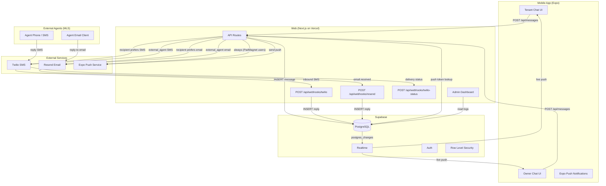

# PadMagnet Communications System — Implementation Plan v3

Finalized 2026-03-13. Covers Twilio SMS, Resend email replies, Expo push notifications, in-app chat enhancements, external MLS agent conversations, and admin tooling.

---

## 1. High-Level Architecture



**Flow summary:**
1. User sends message in-app -> API inserts into `messages` -> Supabase Realtime pushes to both parties instantly via `postgres_changes` subscription.
2. API checks recipient's `preferred_channel` -> sends SMS (Twilio) or email (Resend) as external notification. First delivery attempt is synchronous for instant feel; only failures go to the retry queue.
3. Recipient replies via SMS or email -> webhook fires -> API inserts reply into `messages` -> Realtime pushes to sender's chat UI.
4. Push notification fires for every message regardless of channel (catches offline users).
5. **Both tenants and owners have fully symmetric access.** Each party sees all their conversations in their own chat UI (mobile `(tenant)/messages.js` or `(owner)/messages.js`, and eventually the web dashboard). RLS policies on `conversations` and `messages` enforce that users only see threads where they are `tenant_user_id` or `owner_user_id`. Unread counts, Realtime updates, and reply capability are identical for both roles. The `conversations` table is published to Supabase Realtime so unread badge counts update live on both sides.
6. **External MLS agent conversations.** Many listings come from Bridge Interactive IDX and have a 3rd-party listing agent who is NOT a PadMagnet user. When a tenant starts a conversation on an IDX listing, the conversation is created with `conversation_type = 'external_agent'` and the agent's name, email, and phone are stored directly on the conversation row (pulled from the listing record). The tenant sends messages through the same in-app UI. The API routes the notification to the agent's email (preferred) or phone via the same Twilio/Resend infrastructure. The agent sees a normal email or SMS — no PadMagnet account needed. When the agent replies (email reply-to or SMS back), the existing webhooks route the reply into the conversation thread. The tenant sees it in-app via Realtime, same as any other message. Key differences from internal conversations: `owner_user_id` is NULL, `phone_mappings.user_id` is NULL for external agents, the Resend webhook accepts `senderEmail === conv.external_agent_email` even without a PadMagnet profile, and the Twilio webhook treats `user_id = NULL` in the mapping as an external agent reply. No push notifications are sent to external agents (they have no app). Internal owner flows are completely unchanged.

---

## 2. Database Schema

```sql
-- ============================================================
-- Migration 038: Communications system + external agent support
-- ============================================================

-- A. Ensure conversations + messages have multichannel columns
--    (some may already exist from migration 015 -- IF NOT EXISTS is safe)
ALTER TABLE conversations
  ADD COLUMN IF NOT EXISTS tenant_unread_count int DEFAULT 0,
  ADD COLUMN IF NOT EXISTS owner_unread_count int DEFAULT 0,
  ADD COLUMN IF NOT EXISTS last_message_text text,
  ADD COLUMN IF NOT EXISTS listing_address text;

-- A2. External agent conversation support
--     conversation_type distinguishes internal PadMagnet owner chats from
--     IDX/MLS agent chats where the agent has no PadMagnet account.
--     For external_agent conversations, owner_user_id is NULL and the
--     three external_agent_* fields identify the recipient.
ALTER TABLE conversations
  ADD COLUMN IF NOT EXISTS conversation_type text DEFAULT 'internal_owner'
    CHECK (conversation_type IN ('internal_owner', 'external_agent')),
  ADD COLUMN IF NOT EXISTS external_agent_name text,
  ADD COLUMN IF NOT EXISTS external_agent_email text,
  ADD COLUMN IF NOT EXISTS external_agent_phone text;

ALTER TABLE messages
  ADD COLUMN IF NOT EXISTS channel text CHECK (channel IN ('in_app', 'sms', 'email')),
  ADD COLUMN IF NOT EXISTS external_id text UNIQUE,
  ADD COLUMN IF NOT EXISTS delivery_status text DEFAULT 'sent'
    CHECK (delivery_status IN ('pending', 'sent', 'delivered', 'failed'));

-- RLS on messages (symmetric for tenants AND owners)
-- For external_agent conversations, owner_user_id is NULL so only the
-- tenant_user_id check matches. External agent replies are inserted
-- via service role (webhooks), so INSERT policy doesn't block them.
ALTER TABLE messages ENABLE ROW LEVEL SECURITY;
CREATE POLICY "Users see own messages" ON messages FOR SELECT
  USING (
    sender_id = auth.uid() OR EXISTS (
      SELECT 1 FROM conversations c
      WHERE c.id = messages.conversation_id
      AND (c.tenant_user_id = auth.uid() OR c.owner_user_id = auth.uid())
    )
  );
CREATE POLICY "Participants insert messages" ON messages FOR INSERT
  WITH CHECK (
    EXISTS (
      SELECT 1 FROM conversations c
      WHERE c.id = conversation_id
      AND (c.tenant_user_id = auth.uid() OR c.owner_user_id = auth.uid())
    )
  );

-- B. Add communication columns to profiles
--    preferred_channel defaults: tenants prefer SMS, owners prefer email
ALTER TABLE profiles
  ADD COLUMN IF NOT EXISTS preferred_channel text DEFAULT 'in_app'
    CHECK (preferred_channel IN ('in_app', 'sms', 'email')),
  ADD COLUMN IF NOT EXISTS phone_verified boolean DEFAULT false,
  ADD COLUMN IF NOT EXISTS sms_consent boolean DEFAULT false,
  ADD COLUMN IF NOT EXISTS sms_consent_at timestamptz,
  ADD COLUMN IF NOT EXISTS sms_consent_ip text,
  ADD COLUMN IF NOT EXISTS expo_push_token text;

-- Role-based default: tenants get SMS, owners get email
-- Applied via trigger on INSERT (ALTER COLUMN DEFAULT can't reference other columns)
CREATE OR REPLACE FUNCTION set_default_preferred_channel()
RETURNS trigger AS $$
BEGIN
  IF NEW.preferred_channel IS NULL OR NEW.preferred_channel = 'in_app' THEN
    IF NEW.role = 'tenant' THEN
      NEW.preferred_channel := 'sms';
    ELSE
      NEW.preferred_channel := 'email';
    END IF;
  END IF;
  RETURN NEW;
END;
$$ LANGUAGE plpgsql;

DROP TRIGGER IF EXISTS trg_default_preferred_channel ON profiles;
CREATE TRIGGER trg_default_preferred_channel
  BEFORE INSERT ON profiles
  FOR EACH ROW
  EXECUTE FUNCTION set_default_preferred_channel();

-- C. Webhook logs -- audit trail for all inbound/outbound events
CREATE TABLE IF NOT EXISTS webhook_logs (
  id uuid PRIMARY KEY DEFAULT gen_random_uuid(),
  source text NOT NULL CHECK (source IN ('twilio', 'resend', 'expo')),
  event_type text NOT NULL,
  external_id text,
  payload jsonb NOT NULL DEFAULT '{}',
  status text DEFAULT 'received' CHECK (status IN ('received', 'processed', 'failed', 'duplicate')),
  error_message text,
  conversation_id uuid REFERENCES conversations(id),
  message_id uuid REFERENCES messages(id),
  created_at timestamptz DEFAULT now()
);

CREATE INDEX idx_webhook_logs_source ON webhook_logs(source, created_at DESC);
CREATE INDEX idx_webhook_logs_external_id ON webhook_logs(external_id);

-- D. Message templates for SMS/email notifications
CREATE TABLE IF NOT EXISTS message_templates (
  id uuid PRIMARY KEY DEFAULT gen_random_uuid(),
  slug text UNIQUE NOT NULL,
  channel text NOT NULL CHECK (channel IN ('sms', 'email')),
  subject text,
  body text NOT NULL,
  variables text[] DEFAULT '{}',
  is_active boolean DEFAULT true,
  created_at timestamptz DEFAULT now(),
  updated_at timestamptz DEFAULT now()
);

INSERT INTO message_templates (slug, channel, subject, body, variables) VALUES
  ('new_message_sms', 'sms', NULL,
   'PadMagnet: New message about {{listing_address}} from {{sender_name}}. Reply here or open the app to respond.',
   '{listing_address, sender_name, message_preview}'),
  ('new_message_email', 'email', 'New message about {{listing_address}}',
   '<p>Hi {{recipient_name}},</p><p><strong>{{sender_name}}</strong> sent you a message about <strong>{{listing_address}}</strong>:</p><blockquote>{{message_preview}}</blockquote><p>Reply to this email or <a href="{{inbox_url}}">open the app</a> to respond.</p><p>-- PadMagnet</p>',
   '{recipient_name, sender_name, listing_address, message_preview, inbox_url}'),
  ('external_agent_sms', 'sms', NULL,
   'Hi {{agent_name}}, a renter on PadMagnet is interested in {{listing_address}}. They said: "{{message_preview}}" — Reply to this text to respond.',
   '{agent_name, listing_address, message_preview}'),
  ('external_agent_email', 'email', 'Rental inquiry about {{listing_address}}',
   '<p>Hi {{agent_name}},</p><p>A renter on PadMagnet is interested in your listing at <strong>{{listing_address}}</strong>.</p><blockquote>{{message_preview}}</blockquote><p>Simply reply to this email to respond directly to the renter.</p><p>-- PadMagnet</p>',
   '{agent_name, listing_address, message_preview}')
ON CONFLICT (slug) DO NOTHING;

-- E. Phone number mapping for inbound SMS routing
--    user_id is NULLABLE: NULL means the phone belongs to an external MLS agent
--    (no PadMagnet account). The webhook uses conversation_id to route the reply.
CREATE TABLE IF NOT EXISTS phone_mappings (
  id uuid PRIMARY KEY DEFAULT gen_random_uuid(),
  twilio_number text NOT NULL,
  user_phone text NOT NULL,
  conversation_id uuid NOT NULL REFERENCES conversations(id),
  user_id uuid REFERENCES auth.users(id),
  created_at timestamptz DEFAULT now(),
  UNIQUE(twilio_number, user_phone)
);

CREATE INDEX idx_phone_mappings_lookup
  ON phone_mappings(twilio_number, user_phone);

-- F. Delivery retry queue (only used for failed first attempts)
--    recipient_id is NULLABLE: NULL for external agent deliveries
CREATE TABLE IF NOT EXISTS message_delivery_queue (
  id uuid PRIMARY KEY DEFAULT gen_random_uuid(),
  message_id uuid NOT NULL REFERENCES messages(id),
  channel text NOT NULL CHECK (channel IN ('sms', 'email', 'push')),
  recipient_id uuid REFERENCES auth.users(id),
  payload jsonb NOT NULL DEFAULT '{}',
  attempts int DEFAULT 0,
  max_attempts int DEFAULT 3,
  status text DEFAULT 'pending' CHECK (status IN ('pending', 'processing', 'sent', 'failed', 'cancelled')),
  next_attempt_at timestamptz DEFAULT now(),
  last_error text,
  created_at timestamptz DEFAULT now(),
  updated_at timestamptz DEFAULT now()
);

CREATE INDEX idx_delivery_queue_pending
  ON message_delivery_queue(next_attempt_at)
  WHERE status = 'pending';

-- G. RLS on new tables

ALTER TABLE webhook_logs ENABLE ROW LEVEL SECURITY;
-- No policies = deny all via client. Service role only.

ALTER TABLE message_templates ENABLE ROW LEVEL SECURITY;
-- No policies = admin only via service role.

ALTER TABLE phone_mappings ENABLE ROW LEVEL SECURITY;
CREATE POLICY "Users see own phone mappings"
  ON phone_mappings FOR SELECT
  USING (user_id = auth.uid());

ALTER TABLE message_delivery_queue ENABLE ROW LEVEL SECURITY;
-- No policies = admin only via service role.

-- H. Publish conversations to Supabase Realtime
--    (messages is already published from migration 008)
--    This enables live unread badge updates on both tenant and owner chat tabs
ALTER PUBLICATION supabase_realtime ADD TABLE conversations;

-- I. Atomic unread increment function (fixes existing race condition)
CREATE OR REPLACE FUNCTION increment_unread(
  p_conversation_id uuid,
  p_role text
) RETURNS void AS $$
BEGIN
  IF p_role = 'tenant' THEN
    UPDATE conversations SET tenant_unread_count = tenant_unread_count + 1,
      last_message_at = now() WHERE id = p_conversation_id;
  ELSIF p_role = 'owner' THEN
    UPDATE conversations SET owner_unread_count = owner_unread_count + 1,
      last_message_at = now() WHERE id = p_conversation_id;
  END IF;
END;
$$ LANGUAGE plpgsql SECURITY DEFINER;
```

---

## 3. Backend Folder Structure + Code Skeletons

```
app/api/
├── messages/
│   └── route.js              <- EXISTING (enhance with notification + phone mapping)
├── conversations/
│   ├── route.js              <- EXISTING (enhance with external-agent creation)
│   └── [id]/
│       └── route.js          <- NEW: single conversation GET
├── webhooks/
│   ├── twilio/
│   │   └── route.js          <- NEW: inbound SMS (supports external agent replies)
│   ├── twilio-status/
│   │   └── route.js          <- NEW: delivery status callbacks
│   └── resend/
│       └── route.js          <- NEW: inbound email replies (supports external agent replies)
├── profiles/
│   ├── push-token/
│   │   └── route.js          <- NEW: register Expo push token
│   └── sms-consent/
│       └── route.js          <- NEW: TCPA consent toggle
├── admin/
│   ├── messages/
│   │   └── route.js          <- NEW: message log search/filter
│   └── templates/
│       └── route.js          <- NEW: template CRUD
└── cron/
    └── delivery-retry/
        └── route.js          <- NEW: retry failed deliveries

lib/
├── email.js                  <- EXISTING (add replyTo header)
├── sms.js                    <- NEW: Twilio helper
├── notify.js                 <- NEW: immediate send + retry queue routing (external agent aware)
└── push.js                   <- NEW: Expo push notifications
```

### `lib/sms.js` -- Twilio helper

```js
import twilio from 'twilio';

const client = twilio(
  process.env.TWILIO_ACCOUNT_SID,
  process.env.TWILIO_AUTH_TOKEN
);
const TWILIO_NUMBER = process.env.TWILIO_PHONE_NUMBER;

export async function sendSMS(to, body) {
  const message = await client.messages.create({
    to,
    from: TWILIO_NUMBER,
    body,
    statusCallback: `${process.env.NEXT_PUBLIC_APP_URL}/api/webhooks/twilio-status`,
  });
  return { sid: message.sid, status: message.status };
}

export function validateTwilioSignature(req, url, params) {
  return twilio.validateRequest(
    process.env.TWILIO_AUTH_TOKEN,
    req.headers.get('x-twilio-signature'),
    url,
    params
  );
}
```

### `lib/notify.js` -- Immediate send with retry queue fallback

```js
// First delivery attempt is synchronous for instant feel.
// If the immediate send fails, the message is enqueued in
// message_delivery_queue for retry by the delivery-retry cron.
// This avoids the latency of a queue for the happy path while
// ensuring reliability for transient failures.
//
// Supports two conversation types:
// - internal_owner: recipient is a PadMagnet user (profile lookup, push, channel pref)
// - external_agent: recipient is an MLS agent with no PadMagnet account
//   (email preferred, SMS fallback, no push, contact info from conversation row)

import { sendSMS } from './sms';
import { sendNotificationEmail, sendExternalAgentEmail } from './email';
import { sendPushNotification } from './push';
import { createServiceClient } from './supabase';

export async function notifyRecipient(message, conversation, recipient) {
  const supabase = createServiceClient();
  const channel = recipient.preferred_channel || 'in_app';

  // Always attempt push notification (PadMagnet users only)
  if (recipient.expo_push_token) {
    await sendImmediatelyOrEnqueue(supabase, message.id, recipient.id, 'push', {
      token: recipient.expo_push_token,
      title: `Message from ${message.sender_name}`,
      body: message.body.slice(0, 100),
      data: { conversationId: conversation.id },
    });
  }

  // Route external notification by preference
  if (channel === 'sms' && recipient.phone && recipient.sms_consent) {
    await sendImmediatelyOrEnqueue(supabase, message.id, recipient.id, 'sms', {
      to: recipient.phone,
      listing_address: conversation.listing_address,
      sender_name: message.sender_name,
      message_preview: message.body.slice(0, 140),
    });
  } else if (channel === 'email' && recipient.email) {
    await sendImmediatelyOrEnqueue(supabase, message.id, recipient.id, 'email', {
      to: recipient.email,
      recipient_name: recipient.display_name,
      sender_name: message.sender_name,
      listing_address: conversation.listing_address,
      message_preview: message.body.slice(0, 300),
      inbox_url: `${process.env.NEXT_PUBLIC_APP_URL}/conversation/${conversation.id}`,
      conversationId: conversation.id,
    });
  }
}

// Notify an external MLS agent who has no PadMagnet account.
// Email is preferred (agents check email); SMS is fallback.
// No push notification (they have no app installed).
export async function notifyExternalAgent(message, conversation) {
  const supabase = createServiceClient();
  const { external_agent_name, external_agent_email, external_agent_phone } = conversation;

  // Prefer email — agents are professionals who monitor email
  if (external_agent_email) {
    await sendImmediatelyOrEnqueue(supabase, message.id, null, 'email', {
      to: external_agent_email,
      recipient_name: external_agent_name || 'Listing Agent',
      sender_name: message.sender_name,
      listing_address: conversation.listing_address,
      message_preview: message.body.slice(0, 300),
      conversationId: conversation.id,
      isExternalAgent: true,
    });
  } else if (external_agent_phone) {
    // SMS fallback only if no email available
    await sendImmediatelyOrEnqueue(supabase, message.id, null, 'sms', {
      to: external_agent_phone,
      agent_name: external_agent_name || 'Listing Agent',
      listing_address: conversation.listing_address,
      message_preview: message.body.slice(0, 140),
      isExternalAgent: true,
    });
  }
}

async function sendImmediatelyOrEnqueue(supabase, messageId, recipientId, channel, payload) {
  try {
    // Attempt immediate delivery
    if (channel === 'sms') {
      const body = payload.isExternalAgent
        ? `Hi ${payload.agent_name}, a renter on PadMagnet is interested in ${payload.listing_address}. They said: "${payload.message_preview}" — Reply to this text to respond.`
        : `PadMagnet: New message about ${payload.listing_address} from ${payload.sender_name}. Reply here or open the app to respond.`;
      const { sid } = await sendSMS(payload.to, body);
      await supabase.from('messages').update({ external_id: sid, delivery_status: 'sent' }).eq('id', messageId);
    } else if (channel === 'email') {
      if (payload.isExternalAgent) {
        await sendExternalAgentEmail(payload);
      } else {
        await sendNotificationEmail(payload);
      }
    } else if (channel === 'push') {
      await sendPushNotification(payload.token, payload.title, payload.body, payload.data);
    }
  } catch (err) {
    console.error(`Immediate ${channel} delivery failed, enqueueing for retry:`, err.message);
    // Enqueue for retry by the delivery-retry cron
    // recipient_id is NULL for external agent deliveries
    await supabase.from('message_delivery_queue').insert({
      message_id: messageId,
      recipient_id: recipientId,
      channel,
      payload,
      attempts: 1,
      last_error: err.message,
      next_attempt_at: new Date(Date.now() + 2 * 60 * 1000).toISOString(), // retry in 2min
    });
  }
}
```

### `lib/email.js` -- Add replyTo header (update existing)

```js
// In the existing sendTemplateEmail function, add replyTo when conversationId is provided:

export async function sendNotificationEmail({ to, recipient_name, sender_name, listing_address, message_preview, inbox_url, conversationId }) {
  const replyTo = conversationId
    ? `conv-${conversationId}@${process.env.RESEND_INBOUND_DOMAIN}`
    : undefined;

  await resend.emails.send({
    from: 'PadMagnet <noreply@padmagnet.com>',
    to,
    replyTo,
    subject: `New message about ${listing_address}`,
    html: `<p>Hi ${recipient_name},</p>
      <p><strong>${sender_name}</strong> sent you a message about <strong>${listing_address}</strong>:</p>
      <blockquote>${message_preview}</blockquote>
      <p>Reply to this email or <a href="${inbox_url}">open the app</a> to respond.</p>
      <p>-- PadMagnet</p>`,
  });
}

// Email to external MLS agent — they reply to this email and it routes
// back into the tenant's in-app conversation via the Resend inbound webhook.
// No "open the app" link since they don't have PadMagnet.
export async function sendExternalAgentEmail({ to, recipient_name, listing_address, message_preview, conversationId }) {
  const replyTo = `conv-${conversationId}@${process.env.RESEND_INBOUND_DOMAIN}`;

  await resend.emails.send({
    from: 'PadMagnet <noreply@padmagnet.com>',
    to,
    replyTo,
    subject: `Rental inquiry about ${listing_address}`,
    html: `<p>Hi ${recipient_name},</p>
      <p>A renter on PadMagnet is interested in your listing at <strong>${listing_address}</strong>.</p>
      <blockquote>${message_preview}</blockquote>
      <p>Simply reply to this email to respond directly to the renter.</p>
      <p>-- PadMagnet</p>`,
  });
}
```

### `lib/push.js` -- Expo push notifications

```js
export async function sendPushNotification(token, title, body, data = {}) {
  const response = await fetch('https://exp.host/--/api/v2/push/send', {
    method: 'POST',
    headers: { 'Content-Type': 'application/json' },
    body: JSON.stringify({
      to: token,
      title,
      body,
      data,
      sound: 'default',
      badge: 1,
    }),
  });
  return response.json();
}
```

### Enhanced `POST /api/messages` -- with phone mapping + notification

```js
// Add to existing POST handler in app/api/messages/route.js,
// after successful message INSERT:

import { notifyRecipient, notifyExternalAgent } from '../../../lib/notify';

// ... after successful message insert ...

// Fetch sender name
const { data: sender } = await supabase
  .from('profiles')
  .select('display_name')
  .eq('id', user.id)
  .single();

const senderName = sender?.display_name || 'Someone';

// Branch: external agent vs internal owner
if (conv.conversation_type === 'external_agent') {
  // External MLS agent — no PadMagnet profile, no push notification
  // Upsert phone mapping with user_id = null for SMS reply routing
  if (conv.external_agent_phone) {
    await supabase.from('phone_mappings').upsert({
      twilio_number: process.env.TWILIO_PHONE_NUMBER,
      user_phone: conv.external_agent_phone,
      conversation_id: conv.id,
      user_id: null,
    }, { onConflict: 'twilio_number,user_phone' });
  }

  // Fire external notification to agent (non-blocking)
  notifyExternalAgent(
    { ...message, sender_name: senderName },
    conv
  ).catch(err => console.error('External agent notification error:', err));

} else {
  // Internal owner — standard PadMagnet user flow
  const recipientId = user.id === conv.tenant_user_id
    ? conv.owner_user_id
    : conv.tenant_user_id;

  // Fetch recipient profile for channel routing
  const { data: recipient } = await supabase
    .from('profiles')
    .select('id, email, phone, display_name, preferred_channel, sms_consent, expo_push_token')
    .eq('id', recipientId)
    .single();

  // Upsert phone mapping so inbound SMS replies route to this conversation
  if (recipient.preferred_channel === 'sms' && recipient.phone) {
    await supabase.from('phone_mappings').upsert({
      twilio_number: process.env.TWILIO_PHONE_NUMBER,
      user_phone: recipient.phone,
      conversation_id: conv.id,
      user_id: recipient.id,
    }, { onConflict: 'twilio_number,user_phone' });
  }

  // Fire external notification (non-blocking)
  // First attempt is synchronous; failures enqueue for retry
  notifyRecipient(
    { ...message, sender_name: senderName },
    conv,
    recipient
  ).catch(err => console.error('Notification error:', err));
}
```

### Enhanced `POST /api/conversations` -- external agent creation

```js
// In the existing POST handler for creating conversations:
// When listing.source === 'mls', create an external_agent conversation.

const listing = /* ... fetched listing ... */;

if (listing.source === 'mls') {
  // IDX listing — agent is external, no PadMagnet account
  const listingAddress = [listing.street_number, listing.street_name, listing.city]
    .filter(Boolean).join(' ');

  const { data: conv, error } = await supabase
    .from('conversations')
    .insert({
      listing_id: listing.id,
      tenant_user_id: user.id,
      owner_user_id: null,              // no PadMagnet owner
      conversation_type: 'external_agent',
      external_agent_name: listing.listing_agent_name || null,
      external_agent_email: listing.listing_agent_email || null,
      external_agent_phone: listing.listing_agent_phone || null,
      listing_address: listingAddress,
    })
    .select()
    .single();

} else {
  // Owner listing — standard internal conversation
  const { data: conv, error } = await supabase
    .from('conversations')
    .insert({
      listing_id: listing.id,
      tenant_user_id: user.id,
      owner_user_id: listing.owner_user_id,
      conversation_type: 'internal_owner',
      listing_address: [listing.street_number, listing.street_name, listing.city]
        .filter(Boolean).join(' '),
    })
    .select()
    .single();
}
```

### Webhook skeletons

**`app/api/webhooks/twilio/route.js`** -- Inbound SMS:
```js
export async function POST(request) {
  // 1. Parse form-encoded body (Twilio sends application/x-www-form-urlencoded)
  // 2. Validate Twilio signature
  // 3. Extract: From, To, Body, MessageSid
  // 4. Handle STOP -> set sms_consent=false (skip for external agents). Handle START -> re-enable.
  // 5. Lookup phone_mappings by (twilio_number=To, user_phone=From) -> conversation_id + user_id
  // 6. Dedup check (external_id = MessageSid)
  // 7. If mapping.user_id is NULL -> this is an external agent reply:
  //    - sender_id = NULL in the message INSERT
  //    - Always increment tenant_unread_count (the tenant is the only PadMagnet user)
  // 8. If mapping.user_id is NOT NULL -> standard internal user reply:
  //    - sender_id = mapping.user_id
  //    - Determine recipientRole and call increment_unread normally
  // 9. INSERT into messages with channel='sms', external_id=MessageSid
  // 10. Update last_message_text on conversation
  // 11. Log to webhook_logs
  // 12. Return TwiML <Response/> (empty = no auto-reply)
}
```

**`app/api/webhooks/twilio-status/route.js`** -- Delivery status:
```js
export async function POST(request) {
  // 1. Parse: MessageSid, MessageStatus (queued/sent/delivered/failed/undelivered)
  // 2. Validate Twilio signature
  // 3. UPDATE messages SET delivery_status WHERE external_id = MessageSid
  // 4. UPDATE message_delivery_queue SET status accordingly
  // 5. Log to webhook_logs
  // 6. If failed: flag for retry or alert admin
}
```

**`app/api/cron/delivery-retry/route.js`** -- Process retry queue:
```js
export async function GET(request) {
  // Vercel Cron: runs every 2 minutes
  // 1. SELECT from message_delivery_queue WHERE status='pending' AND next_attempt_at <= now()
  // 2. For each: attempt delivery via sms/email/push
  // 3. On success: UPDATE status='sent'
  // 4. On failure: increment attempts, set next_attempt_at with exponential backoff
  //    (attempt 2: +10min, attempt 3: +30min)
  // 5. If attempts >= max_attempts: UPDATE status='failed', alert admin
}
```

---

## 4. Frontend Integration

### A. Register push token on login

```js
// In AuthProvider or root layout, after successful auth:
import * as Notifications from 'expo-notifications';
import Constants from 'expo-constants';

async function registerPushToken() {
  const { status } = await Notifications.requestPermissionsAsync();
  if (status !== 'granted') return;
  const projectId = Constants.expoConfig?.extra?.eas?.projectId;
  const token = (await Notifications.getExpoPushTokenAsync({ projectId })).data;
  await apiFetch('/api/profiles/push-token', {
    method: 'PUT',
    body: JSON.stringify({ expo_push_token: token }),
  });
}
```

### B. Push notification handler (navigate to conversation)

```js
// In root _layout.js:
Notifications.addNotificationResponseReceivedListener(response => {
  const { conversationId } = response.notification.request.content.data;
  if (conversationId) router.push(`/conversation/${conversationId}`);
});
```

### C. Realtime subscriptions for symmetric tenant + owner access

Both `(tenant)/messages.js` and `(owner)/messages.js` render the same `MessagesScreen` component. Each user sees only their conversations (enforced by RLS: `tenant_user_id = auth.uid() OR owner_user_id = auth.uid()`). Add a subscription on the `conversations` table alongside the existing `messages` subscription so unread badges update live:

```js
// In MessagesScreen.js -- add alongside existing messages subscription:
const convChannel = supabase
  .channel('conversations-updates')
  .on('postgres_changes',
    { event: 'UPDATE', schema: 'public', table: 'conversations' },
    (payload) => {
      // Realtime + RLS ensures each user only receives updates for their own conversations
      fetchConversations();
    }
  )
  .subscribe();
```

Owners have the exact same Realtime updates, unread counts, and reply capability as tenants. The `conversations` table is published to Supabase Realtime (migration 038, section H), and RLS on `messages` proves symmetric access: both `tenant_user_id` and `owner_user_id` are checked equally in every policy.

### D. Unified conversation list with Agent vs Owner badge

The tenant's `MessagesScreen` displays ALL conversations — both internal owner chats and external agent chats — in a single unified list. Each conversation row shows a small badge indicating the type:

```js
// In the conversation list item component:
const isAgent = conversation.conversation_type === 'external_agent';
const recipientName = isAgent
  ? conversation.external_agent_name || 'Listing Agent'
  : conversation.owner_display_name;

// Badge next to name
<View style={styles.nameRow}>
  <Text style={styles.name}>{recipientName}</Text>
  {isAgent && (
    <View style={styles.agentBadge}>
      <Text style={styles.agentBadgeText}>Agent</Text>
    </View>
  )}
</View>

// Badge styles
agentBadge: {
  backgroundColor: COLORS.brandOrange,
  paddingHorizontal: 6,
  paddingVertical: 2,
  borderRadius: 8,
  marginLeft: 6,
},
agentBadgeText: {
  fontFamily: FONTS.body.semiBold,
  fontSize: 9,
  color: '#fff',
},
```

The chat thread view works identically for both types. External agent messages (inserted by webhooks with `sender_id = NULL`) are displayed with the agent's name from `conversation.external_agent_name`. The reply input and send button work the same — `POST /api/messages` handles the routing.

### E. SMS consent toggle on Profile screen

```js
<Toggle
  label="Receive SMS notifications"
  value={smsConsent}
  onValueChange={async (val) => {
    await apiFetch('/api/profiles/sms-consent', {
      method: 'PUT',
      body: JSON.stringify({ sms_consent: val }),
    });
    setSmsConsent(val);
  }}
/>
```

### F. Channel preference selector on Profile screen

```js
// Chip selector: In-App Only | SMS | Email
// Saves to profiles.preferred_channel
// Default: tenants = SMS, owners = email (set by DB trigger on profile creation)
```

---

## 5. Admin Dashboard Pages

```
app/admin/panels/
├── MessagingPanel.js         <- NEW: messaging overview + stats
└── (existing panels...)

app/admin/
├── messages/
│   └── page.js               <- NEW: full message log
├── webhooks/
│   └── page.js               <- NEW: webhook log viewer
└── templates/
    └── page.js               <- NEW: message template editor
```

**MessagingPanel.js (sidebar item):**
- Stats cards: Total conversations, Messages today, SMS sent/delivered/failed, Emails sent
- Breakdown: Internal owner vs External agent conversations
- Recent webhook errors (last 24h)
- Quick links to full logs

**Message Log page (`/admin/messages`):**
- Searchable table: conversation ID, participants, channel, delivery status, timestamp
- Filters: channel (in_app/sms/email), status (sent/failed), date range, conversation type (internal/external)
- Click to expand -> full thread view
- Retry button on failed messages
- Test Send button (send test SMS/email to admin number)

**Webhook Log page (`/admin/webhooks`):**
- Table: source (twilio/resend), event type, status, timestamp, conversation link
- Expandable payload viewer (JSON)
- Filter by source, status, date

**Template Editor (`/admin/templates`):**
- CRUD for `message_templates` table
- Live preview with sample variables
- Channel selector (sms/email)
- Character counter for SMS (160 char segments)

---

## 6. Implementation Plan (4 Weeks)

### Week 1: Foundation + SMS + External Agents
| Day | Task | Effort |
|-----|------|--------|
| 1 | Run migration 038 (all new tables, columns incl. external agent fields, RLS policies, Realtime publication, triggers, atomic increment RPC) | 1h |
| 1 | Twilio account setup: buy number, register A2P 10DLC campaign | 2h |
| 1-2 | Build `lib/sms.js`, `lib/notify.js` (immediate send + retry queue + external agent branch), `lib/push.js` | 5h |
| 2 | Build `/api/webhooks/twilio` (inbound SMS, with external agent user_id=NULL handling) | 3h |
| 2 | Build `/api/webhooks/twilio-status` (delivery callbacks) | 2h |
| 3 | Enhance `POST /api/messages` with `notifyRecipient()` / `notifyExternalAgent()` + phone mapping upsert (user_id=NULL for agents) | 3h |
| 3 | Wire atomic `increment_unread` RPC into all message insertion points | 1h |
| 4 | Enhance `POST /api/conversations` with external-agent creation logic (detect `listing.source === 'mls'`, populate external_agent_* fields from listing record) | 3h |
| 4 | Build phone number collection + verification UI (profile screen) | 3h |
| 5 | Build SMS consent flow (TCPA-compliant opt-in + STOP handling) | 3h |

### Week 2: Email Replies + Push
| Day | Task | Effort |
|-----|------|--------|
| 1 | Configure Resend inbound domain (`inbound.padmagnet.com` MX records) | 1h |
| 1 | Build `/api/webhooks/resend` with svix verification + `resend.emails.get` + external agent email matching | 3h |
| 2 | Update `lib/email.js` to set `replyTo: conv-{id}@inbound.padmagnet.com` on all outbound notification emails + add `sendExternalAgentEmail` | 2h |
| 2 | Build email reply chain stripping (extract new content only) | 2h |
| 3 | Expo push notification setup (credentials, permissions) | 2h |
| 3 | Push token registration (using `Constants.expoConfig.extra.eas.projectId`) + notification handler in mobile app | 3h |
| 4 | Build delivery retry cron (`/api/cron/delivery-retry`) | 3h |
| 5 | Wire `inquiry_alert` email template to fire on first conversation message | 1h |
| 5 | Add Realtime subscription on `conversations` table for unread badges (both roles) | 2h |

### Week 3: Admin + Reliability
| Day | Task | Effort |
|-----|------|--------|
| 1-2 | Admin MessagingPanel (stats, recent errors, internal/external breakdown) | 4h |
| 2-3 | Admin Message Log page (search, filter, retry, conversation type filter) | 5h |
| 3 | Admin Webhook Log page | 3h |
| 4 | Admin Template Editor with live preview | 4h |
| 5 | Rate limiting on message send (per-user, per-conversation) | 2h |
| 5 | Message deduplication (external_id uniqueness check) | 1h |

### Week 4: Polish + Testing + Compliance Audit
| Day | Task | Effort |
|-----|------|--------|
| 1 | End-to-end testing: tenant sends -> owner gets SMS -> replies -> tenant sees in app | 4h |
| 1 | End-to-end testing: same flow with email channel | 3h |
| 2 | End-to-end testing: tenant messages IDX agent -> agent replies via email -> tenant sees in app | 3h |
| 2 | End-to-end testing: tenant messages IDX agent -> agent replies via SMS -> tenant sees in app | 2h |
| 2 | Edge cases: offline user, failed delivery, retry, long threads, agent with no email or phone | 3h |
| 3 | 10DLC campaign approval follow-up (can take 1-3 weeks from Twilio) | 1h |
| 3 | Channel preference UI on both tenant + owner profile screens | 3h |
| 3 | Push notification deep linking (tap -> open conversation) | 2h |
| 4 | Unified MessagesScreen: Agent badge, external agent name display, sender_id=NULL rendering | 3h |
| 4 | Compliance audit: TCPA consent records, CAN-SPAM unsubscribe, STOP handling | 3h |
| 5 | Documentation, monitoring setup, final review | 3h |

**10DLC note:** Campaign registration can take 1-3 weeks for approval. Submit on Day 1 of Week 1. Use Twilio test credentials until approved.

---

## 7. Testing Plan

**Twilio test credentials:**
- Use `TWILIO_TEST_ACCOUNT_SID` + `TWILIO_TEST_AUTH_TOKEN` for development
- Test numbers: `+15005550006` (valid), `+15005550001` (invalid/unroutable)
- Inbound testing: Use Twilio's webhook inspector or ngrok -> Vercel preview URL

**Resend sandbox:**
- Resend allows sending to verified emails only in sandbox mode
- Test inbound: Use Resend's webhook test endpoint or `curl` with sample payloads

**Edge cases to test:**

| Scenario | Expected behavior |
|----------|------------------|
| Owner offline, tenant sends message | SMS/email fires immediately, push notification sent. Owner sees message when they open app |
| SMS delivery fails (bad number) | Immediate attempt fails, enqueued for retry 2x, then alerts admin |
| Email bounces | Resend webhook updates delivery_status, no retry on hard bounce |
| User replies "STOP" via SMS | `sms_consent` set to false, future SMS blocked, confirmation text sent |
| Duplicate webhook fires | `external_id` UNIQUE constraint prevents double-insert, webhook log marks `duplicate` |
| Very long thread (500+ messages) | Pagination on GET messages (add `limit` + `offset` if not present) |
| User has no phone AND no email preference | Falls back to in_app only + push notification |
| Resend email reply with quoted chain | Strip `>` lines and `On X wrote:` prefix, extract only new content |
| Two conversations with same owner | Phone mapping upsert routes inbound SMS to most recent conversation |
| Owner replies from web dashboard | Same API + Realtime path -- tenant sees reply instantly on mobile |
| Tenant messages IDX listing agent via email | Email sent with replyTo header. Agent replies -> Resend webhook matches `external_agent_email` -> message inserted with `sender_id=NULL` -> tenant sees in Realtime |
| Tenant messages IDX listing agent via SMS | SMS sent to `external_agent_phone`. Agent replies -> Twilio webhook finds phone_mapping with `user_id=NULL` -> message inserted with `sender_id=NULL` -> tenant sees in Realtime |
| IDX listing has no agent email or phone | Conversation created but no notification sent. Tenant sees a message explaining no contact info is available |
| External agent replies "STOP" to SMS | STOP handler skips profile update (no profile). Log the opt-out. Future sends to that number are blocked at the Twilio level (Twilio auto-enforces STOP for 10DLC) |
| Same agent phone used across multiple IDX listings | Phone mapping upsert routes to most recent conversation (same as internal owners) |

---

## 8. Compliance + Monitoring Checklist

### TCPA / 10DLC (SMS)
- [ ] Register A2P 10DLC campaign with Twilio (brand registration + campaign)
- [ ] Collect explicit opt-in with timestamp + IP address before any SMS
- [ ] Display consent language: *"By enabling SMS, you agree to receive text messages from PadMagnet about your rental inquiries. Msg & data rates may apply. Reply STOP to unsubscribe."*
- [ ] Handle STOP -> immediately set `sms_consent = false`, send confirmation
- [ ] Handle HELP -> reply with support info
- [ ] Include "Reply STOP to unsubscribe" in first SMS to each user
- [ ] Store `sms_consent_at` + `sms_consent_ip` for audit trail
- [ ] External agent SMS: Twilio auto-enforces STOP at the carrier level for 10DLC. No additional opt-in needed because the agent is not a subscriber — they are receiving a one-time inquiry (transactional, not marketing).

### CAN-SPAM (Email)
- [ ] Include PadMagnet LLC physical address in email footer
- [ ] Include unsubscribe link in notification emails
- [ ] Honor unsubscribe within 10 business days (immediate is better)
- [ ] Never send to users who have unsubscribed
- [ ] External agent emails: Transactional (rental inquiry), not marketing. CAN-SPAM "transactional or relationship" exception applies. Still include physical address and PadMagnet identity in footer for trust.

### Monitoring
- [ ] **Twilio Console**: Message logs, error rates, 10DLC campaign status, monthly spend
- [ ] **Resend Dashboard**: Delivery rates, bounces, inbound webhook logs
- [ ] **Supabase Dashboard**: `webhook_logs` table queries, RLS policy audit
- [ ] **Vercel**: Function execution logs, cron job success/failure, error rates
- [ ] **Admin Dashboard**: Daily check of failed deliveries, webhook errors, consent audit
- [ ] **Admin Dashboard**: External agent conversation volume, reply rates, delivery failures

### Environment Variables to Add
```
TWILIO_ACCOUNT_SID=
TWILIO_AUTH_TOKEN=
TWILIO_PHONE_NUMBER=           # purchased 10DLC number
RESEND_INBOUND_DOMAIN=         # inbound.padmagnet.com
RESEND_WEBHOOK_SECRET=         # svix signing secret from Resend dashboard
```

---

## 9. Ready-to-Paste Webhook + Helper Code

### Twilio Inbound SMS Webhook

```js
// app/api/webhooks/twilio/route.js
import { createServiceClient } from '../../../../lib/supabase';
import { validateTwilioSignature } from '../../../../lib/sms';
import { NextResponse } from 'next/server';

export const dynamic = 'force-dynamic';

export async function POST(request) {
  const supabase = createServiceClient();
  let logId = null;

  try {
    const formData = await request.formData();
    const params = Object.fromEntries(formData.entries());
    const { From, To, Body, MessageSid, OptOutType } = params;

    const { data: log } = await supabase
      .from('webhook_logs')
      .insert({
        source: 'twilio',
        event_type: OptOutType ? `opt_out_${OptOutType}` : 'inbound_sms',
        external_id: MessageSid,
        payload: params,
      })
      .select('id')
      .single();
    logId = log?.id;

    const url = `${process.env.NEXT_PUBLIC_APP_URL}/api/webhooks/twilio`;
    if (!validateTwilioSignature(request, url, params)) {
      await updateLog(supabase, logId, 'failed', 'Invalid signature');
      return new Response('<Response/>', { status: 403, headers: { 'Content-Type': 'text/xml' } });
    }

    // STOP/START handling — only applies to PadMagnet users with profiles.
    // External agents have no profile; Twilio auto-enforces STOP at carrier level for 10DLC.
    if (OptOutType === 'STOP') {
      await supabase
        .from('profiles')
        .update({ sms_consent: false })
        .eq('phone', From);
      await updateLog(supabase, logId, 'processed');
      return twiml('You have been unsubscribed from PadMagnet SMS. Reply START to re-subscribe.');
    }

    if (OptOutType === 'START') {
      await supabase
        .from('profiles')
        .update({ sms_consent: true, sms_consent_at: new Date().toISOString() })
        .eq('phone', From);
      await updateLog(supabase, logId, 'processed');
      return twiml('You have been re-subscribed to PadMagnet SMS notifications.');
    }

    const { data: existing } = await supabase
      .from('messages')
      .select('id')
      .eq('external_id', MessageSid)
      .maybeSingle();

    if (existing) {
      await updateLog(supabase, logId, 'duplicate');
      return twiml();
    }

    const { data: mapping } = await supabase
      .from('phone_mappings')
      .select('conversation_id, user_id')
      .eq('twilio_number', To)
      .eq('user_phone', From)
      .maybeSingle();

    if (!mapping) {
      await updateLog(supabase, logId, 'failed', 'No phone mapping found');
      return twiml();
    }

    // Determine sender_id:
    // - If mapping.user_id is set -> internal PadMagnet user replying
    // - If mapping.user_id is NULL -> external MLS agent replying
    const senderId = mapping.user_id || null;

    const { data: message } = await supabase
      .from('messages')
      .insert({
        conversation_id: mapping.conversation_id,
        sender_id: senderId,
        body: Body,
        channel: 'sms',
        external_id: MessageSid,
        delivery_status: 'delivered',
        from_phone: From,
        to_phone: To,
      })
      .select('id')
      .single();

    const { data: conv } = await supabase
      .from('conversations')
      .select('tenant_user_id, owner_user_id, conversation_type')
      .eq('id', mapping.conversation_id)
      .single();

    if (conv.conversation_type === 'external_agent') {
      // External agent replied — always increment tenant's unread count
      await supabase.rpc('increment_unread', {
        p_conversation_id: mapping.conversation_id,
        p_role: 'tenant',
      });
    } else {
      // Internal conversation — determine which side to increment
      const recipientRole = senderId === conv.tenant_user_id ? 'owner' : 'tenant';
      await supabase.rpc('increment_unread', {
        p_conversation_id: mapping.conversation_id,
        p_role: recipientRole,
      });
    }

    await supabase
      .from('conversations')
      .update({ last_message_text: Body.slice(0, 200) })
      .eq('id', mapping.conversation_id);

    await updateLog(supabase, logId, 'processed', null, mapping.conversation_id, message?.id);
    return twiml();
  } catch (err) {
    console.error('Twilio webhook error:', err);
    if (logId) await updateLog(supabase, logId, 'failed', err.message);
    return twiml();
  }
}

function twiml(message) {
  const body = message
    ? `<Response><Message>${message}</Message></Response>`
    : '<Response/>';
  return new Response(body, { headers: { 'Content-Type': 'text/xml' } });
}

async function updateLog(supabase, id, status, error, conversationId, messageId) {
  if (!id) return;
  const update = { status };
  if (error) update.error_message = error;
  if (conversationId) update.conversation_id = conversationId;
  if (messageId) update.message_id = messageId;
  await supabase.from('webhook_logs').update(update).eq('id', id);
}
```

### Resend Inbound Email Webhook (svix-verified)

```js
// app/api/webhooks/resend/route.js
// npm i svix
import { Webhook } from 'svix';
import { createServiceClient } from '../../../../lib/supabase';
import { Resend } from 'resend';
import { NextResponse } from 'next/server';

export const dynamic = 'force-dynamic';

const wh = new Webhook(process.env.RESEND_WEBHOOK_SECRET);
const resend = new Resend(process.env.RESEND_API_KEY);

export async function POST(request) {
  const supabase = createServiceClient();
  let logId = null;

  try {
    const rawBody = await request.text();
    const body = JSON.parse(rawBody);

    // Verify svix signature
    wh.verify(rawBody, {
      'svix-id': request.headers.get('svix-id'),
      'svix-timestamp': request.headers.get('svix-timestamp'),
      'svix-signature': request.headers.get('svix-signature'),
    });

    const { data: log } = await supabase
      .from('webhook_logs')
      .insert({
        source: 'resend',
        event_type: body.type,
        external_id: body.data?.email_id,
        payload: body,
      })
      .select('id')
      .single();
    logId = log?.id;

    if (body.type !== 'email.received') {
      await updateLog(supabase, logId, 'processed');
      return NextResponse.json({ ok: true });
    }

    const { data } = body;

    // Fetch full email content via Resend API
    const fullEmail = await resend.emails.get(data.email_id);
    const rawText = fullEmail.data?.text || '';
    const cleanBody = stripReplyChain(rawText);

    if (!cleanBody.trim()) {
      await updateLog(supabase, logId, 'processed', 'Empty reply body after stripping');
      return NextResponse.json({ ok: true });
    }

    // Parse conversation ID from To address: conv-{uuid}@inbound.padmagnet.com
    const toAddr = Array.isArray(data.to) ? data.to[0] : data.to;
    const convMatch = toAddr?.match(/conv-([a-f0-9-]{36})@/i);
    if (!convMatch) {
      await updateLog(supabase, logId, 'failed', `Could not parse conversation ID from: ${toAddr}`);
      return NextResponse.json({ error: 'Unknown recipient' }, { status: 400 });
    }
    const conversationId = convMatch[1];

    // Dedup check
    const { data: existing } = await supabase
      .from('messages')
      .select('id')
      .eq('external_id', data.email_id)
      .maybeSingle();

    if (existing) {
      await updateLog(supabase, logId, 'duplicate');
      return NextResponse.json({ ok: true });
    }

    // Look up conversation + verify sender is participant OR external agent
    const { data: conv } = await supabase
      .from('conversations')
      .select('id, tenant_user_id, owner_user_id, conversation_type, external_agent_email')
      .eq('id', conversationId)
      .single();

    if (!conv) {
      await updateLog(supabase, logId, 'failed', 'Conversation not found');
      return NextResponse.json({ error: 'Not found' }, { status: 404 });
    }

    const senderEmail = typeof data.from === 'string' ? data.from : data.from?.email || data.from?.[0];
    let senderId = null;

    // Check 1: Is sender a PadMagnet participant?
    const participantIds = [conv.tenant_user_id, conv.owner_user_id].filter(Boolean);
    if (participantIds.length > 0) {
      const { data: senderProfile } = await supabase
        .from('profiles')
        .select('id')
        .eq('email', senderEmail)
        .in('id', participantIds)
        .maybeSingle();
      if (senderProfile) senderId = senderProfile.id;
    }

    // Check 2: Is sender an external agent for this conversation?
    const isExternalAgent = !senderId
      && conv.conversation_type === 'external_agent'
      && conv.external_agent_email
      && senderEmail.toLowerCase() === conv.external_agent_email.toLowerCase();

    if (!senderId && !isExternalAgent) {
      await updateLog(supabase, logId, 'failed', `Sender ${senderEmail} not a participant or recognized agent`);
      return NextResponse.json({ error: 'Unauthorized sender' }, { status: 403 });
    }

    // Insert message — sender_id is NULL for external agent replies
    const { data: message } = await supabase
      .from('messages')
      .insert({
        conversation_id: conversationId,
        sender_id: senderId,
        body: cleanBody,
        channel: 'email',
        external_id: data.email_id,
        delivery_status: 'delivered',
        from_email: senderEmail,
      })
      .select('id')
      .single();

    // Increment unread for the appropriate party
    if (isExternalAgent) {
      // External agent replied — always increment tenant's unread count
      await supabase.rpc('increment_unread', {
        p_conversation_id: conversationId,
        p_role: 'tenant',
      });
    } else {
      const recipientRole = senderId === conv.tenant_user_id ? 'owner' : 'tenant';
      await supabase.rpc('increment_unread', {
        p_conversation_id: conversationId,
        p_role: recipientRole,
      });
    }

    await supabase
      .from('conversations')
      .update({ last_message_text: cleanBody.slice(0, 200) })
      .eq('id', conversationId);

    await updateLog(supabase, logId, 'processed', null, conversationId, message?.id);
    return NextResponse.json({ ok: true });
  } catch (err) {
    console.error('Resend webhook error:', err);
    if (logId) await updateLog(supabase, logId, 'failed', err.message);
    return NextResponse.json({ error: err.message }, { status: 500 });
  }
}

function stripReplyChain(text) {
  const markers = [
    /\n\s*On .+ wrote:\s*$/ms,
    /\n\s*-{2,}\s*Original Message/mi,
    /\n\s*>{1,}/m,
    /\n\s*From:\s+/m,
    /\n\s*Sent from my /m,
    /\n\s*--\s*\n/m,
  ];
  let clean = text;
  for (const marker of markers) {
    const match = clean.match(marker);
    if (match) clean = clean.slice(0, match.index);
  }
  return clean.trim();
}

async function updateLog(supabase, id, status, error, conversationId, messageId) {
  if (!id) return;
  const update = { status };
  if (error) update.error_message = error;
  if (conversationId) update.conversation_id = conversationId;
  if (messageId) update.message_id = messageId;
  await supabase.from('webhook_logs').update(update).eq('id', id);
}
```

---

### External Agent Extension Summary

- **4 new columns on `conversations`**: `conversation_type` (`'internal_owner'` | `'external_agent'`), `external_agent_name`, `external_agent_email`, `external_agent_phone`. Default is `'internal_owner'` — zero impact on existing flows.
- **Conversation creation**: When `listing.source === 'mls'`, set `conversation_type = 'external_agent'`, `owner_user_id = NULL`, and populate the three agent fields from the listing record (`listing_agent_name`, `listing_agent_email`, `listing_agent_phone`).
- **Notification routing**: New `notifyExternalAgent()` function in `lib/notify.js` sends email (preferred) or SMS to the agent's contact info stored on the conversation. Uses the same `sendImmediatelyOrEnqueue` path with `isExternalAgent: true` flag for template selection. No push notification (agent has no app).
- **Phone mappings**: Upserted with `user_id = NULL` for external agents. The Twilio webhook treats `mapping.user_id === null` as an external agent reply — inserts message with `sender_id = NULL` and always increments `tenant_unread_count`.
- **Resend webhook**: Adds a second check after the profile lookup fails: if `conv.conversation_type === 'external_agent'` and `senderEmail === conv.external_agent_email`, accept the reply and insert with `sender_id = NULL`.
- **Delivery queue**: `recipient_id` made NULLABLE to support external agent deliveries where there is no auth.users row.
- **Frontend**: Unified `MessagesScreen` — single list for both conversation types. Orange "Agent" badge on external agent conversations. Chat thread renders `sender_id = NULL` messages using `conversation.external_agent_name`.
- **RLS unchanged**: External agent conversations have `owner_user_id = NULL`, so only the `tenant_user_id` check matches in the SELECT policy. Webhook-inserted messages (external agent replies) use service role, bypassing INSERT RLS.
- **Compliance**: External agent SMS is transactional (inquiry, not marketing). Twilio auto-enforces STOP at carrier level for 10DLC. External agent emails are transactional under CAN-SPAM. No additional opt-in required from agents.
- **Internal owner flows**: Completely unchanged. The `conversation_type` defaults to `'internal_owner'` and all existing code paths remain untouched.

### Key Design Decisions

- **Phone mappings creation**: Upsert in `POST /api/messages` right after INSERT, before `notifyRecipient` — ensures inbound SMS replies route to correct conversation
- **Resend webhook**: svix-verified using `Webhook.verify()` + `resend.emails.get()` for full email content
- **Immediate delivery**: `sendImmediatelyOrEnqueue` sends synchronously first; only failures go to retry queue (no queue latency on happy path)
- **Reply-To header**: Outbound emails set `replyTo: conv-{id}@inbound.padmagnet.com` so email replies route back to correct thread
- **Role-based channel default**: Postgres trigger sets `preferred_channel` to `sms` for tenants, `email` for owners on profile creation
- **Expo push token**: Uses `Constants.expoConfig.extra.eas.projectId` instead of hardcoded ID
- **Symmetric access**: Both roles have identical chat access, enforced by RLS
- **Conversations Realtime**: `ALTER PUBLICATION` for `conversations` table enabling live unread badge updates for both roles
- **External agents on conversations table**: Agent contact info stored directly on the conversation row (not a separate table) because agents are ephemeral — they have no PadMagnet identity. This keeps the schema simple and avoids a join for every message send.
- **NULL sender_id convention**: External agent messages have `sender_id = NULL`. The frontend checks for this and displays the agent name from the conversation record. This is cleaner than creating phantom user records for non-users.
